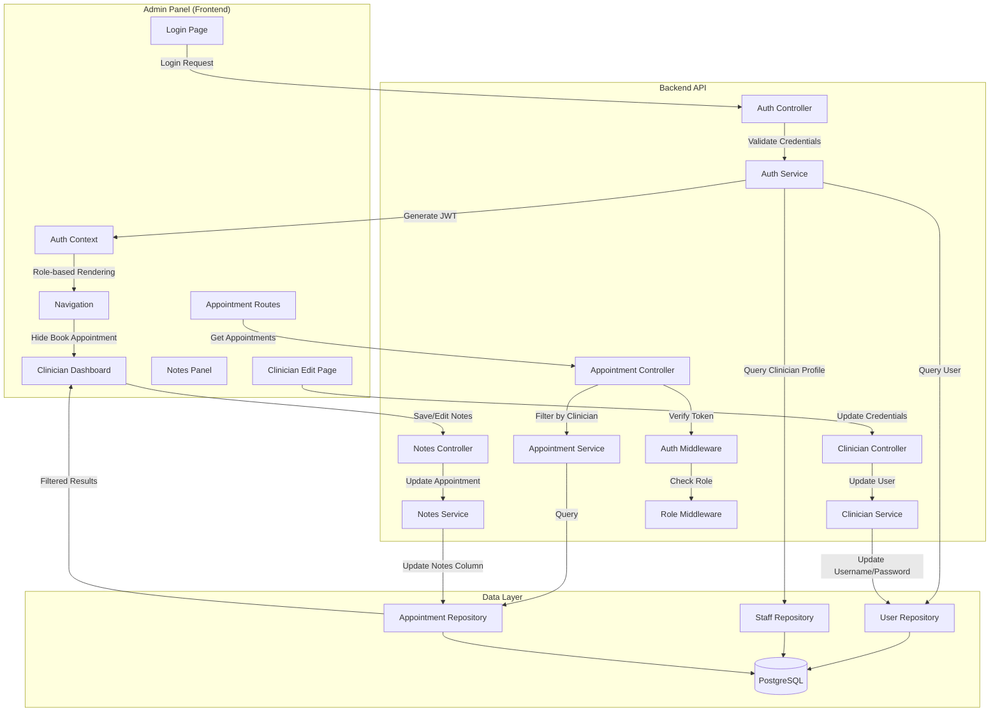

# Design Document: Clinician Admin Sign-In

## Overview

This feature enables clinicians to authenticate and access the admin panel using their username and password credentials. Clinicians will have a restricted view showing only their own appointments, maintaining data privacy and security. The implementation extends the existing authentication system to support clinician-specific access control while maintaining backward compatibility with existing admin and manager authentication flows.

### Key Design Goals

1. Enable clinician authentication using existing username/password credentials
2. Implement role-based access control to restrict clinicians to their own data
3. Filter appointments by clinician ID automatically
4. Provide dedicated clinician dashboard with enhanced appointment display
5. Support appointment notes management for clinicians
6. Display Google Meet links for online appointments
7. Restrict clinician capabilities (no booking functionality)
8. Enable admin editing of clinician credentials
9. Maintain backward compatibility with existing authentication methods

### Scope

**In Scope:**

- Backend authentication endpoint modifications to support clinician login
- JWT token enhancement to include clinician ID
- Appointment filtering by clinician ID
- Role-based middleware for access control
- Clinician dashboard UI with numbered appointment rows
- Google Meet link display for online appointments
- Notes management system (UI, API, database schema)
- Removal of book appointment functionality for clinicians
- Username/password field visibility on clinician edit page
- Admin panel UI adaptation for clinician role

**Out of Scope:**

- New authentication methods (phone/OTP for clinicians)
- Multi-centre clinician support (clinicians work at their primary centre only)
- Patient-facing notes visibility
- Video consultation functionality (only link display)
- Appointment rescheduling by clinicians

## Architecture

### System Components



````

### Authentication Flow

```mermaid
sequenceDiagram
    participant C as Clinician
    participant LP as Login Page
    participant API as Auth API
    participant DB as Database
    participant JWT as JWT Service

    C->>LP: Enter username & password
    LP->>API: POST /api/auth/login/username-password
    API->>DB: Query users table (username, STAFF type)
    DB-->>API: User record
    API->>DB: Query clinician_profiles (user_id)
    DB-->>API: Clinician profile (id, primary_centre_id)

    alt Clinician profile exists
        API->>JWT: Generate token with clinicianId
        JWT-->>API: Access & Refresh tokens
        API-->>LP: {user, accessToken, refreshToken, clinicianId}
        LP->>LP: Store tokens & user data
        LP-->>C: Redirect to appointments
    else No clinician profile
        API-->>LP: 403 Access denied
        LP-->>C: Show error message
    end
````

````

### Appointment Filtering Flow

```mermaid
sequenceDiagram
    participant C as Clinician
    participant UI as Admin Panel
    participant API as Appointment API
    participant MW as Auth Middleware
    participant SVC as Appointment Service
    participant DB as Database

    C->>UI: Navigate to appointments
    UI->>API: GET /api/appointments (with JWT)
    API->>MW: Verify JWT token
    MW->>MW: Extract userId, roles, clinicianId
    MW-->>API: Authenticated request
    API->>SVC: Get appointments (userId, roles)

    alt User has CLINICIAN role
        SVC->>SVC: Apply clinician filter
        SVC->>DB: SELECT * WHERE clinician_id = ?
        DB-->>SVC: Clinician's appointments only
    else User has ADMIN/MANAGER role
        SVC->>DB: SELECT * (all appointments)
        DB-->>SVC: All appointments
    end

    SVC-->>API: Filtered appointments
    API-->>UI: Appointment list
    UI-->>C: Display appointments
````

### Google Meet Link Generation Flow

```mermaid
sequenceDiagram
    participant P as Patient
    participant BF as Booking Frontend
    participant API as Booking API
    participant GM as Google Meet Util
    participant GC as Google Calendar
    participant DB as Database

    P->>BF: Book appointment (mode: ONLINE)
    BF->>API: POST /api/booking/create
    API->>API: Validate booking data

    alt Appointment mode is ONLINE
        API->>GM: createMeetLinkForAppointmentFromFrontend()
        GM->>GC: Create calendar event with Meet
        GC-->>GM: {meetLink, eventId}
        GM-->>API: Return Meet link and event ID
        API->>DB: INSERT appointment with google_meet_link
    else Appointment mode is IN_PERSON
        API->>DB: INSERT appointment (no Meet link)
    end

    DB-->>API: Appointment created
    API-->>BF: Appointment confirmation
    BF-->>P: Show confirmation with Meet link (if online)
```

````

## Components and Interfaces

### Backend Components

#### 1. Auth Service Enhancement

**File:** `backend/src/services/auth.services.ts`

**Modifications:**
- Enhance `loginWithUsernamePassword()` to query clinician profile
- Add clinician ID to JWT payload
- Return clinician information in auth response

**New Interface:**
```typescript
interface AuthResponse {
  user: {
    id: string;
    name: string;
    email: string | null;
    phone: string | null;
    username: string | null;
    role: string;
    avatar: string | null;
    centreIds: string[];
    isActive: boolean;
    createdAt: Date;
    updatedAt: Date;
    clinicianId?: number;  // NEW: Added for clinician users
  };
  accessToken: string;
  refreshToken: string;
}
````

#### 2. JWT Payload Enhancement

**File:** `backend/src/utils/jwt.ts`

**Modifications:**

```typescript
export interface JwtPayload {
  userId: number;
  phone: string;
  userType: "PATIENT" | "STAFF";
  roles: string[];
  clinicianId?: number; // NEW: Added for clinician role
}
```

#### 3. Appointment Repository Enhancement

**File:** `backend/src/repositories/appointment.repository.ts`

**New Method:**

```typescript
async findAppointmentsByClinicianId(
  clinicianId: number,
  filters?: {
    status?: AppointmentStatus[];
    startDate?: string;
    endDate?: string;
  }
): Promise<AppointmentWithDetails[]> {
  const conditions: string[] = [
    "a.clinician_id = $1",
    "a.is_active = TRUE",
    "a.scheduled_start_at >= NOW()"  // Only upcoming appointments
  ];

  const params: any[] = [clinicianId];
  let paramIndex = 2;

  if (filters?.status && filters.status.length > 0) {
    conditions.push(`a.status = ANY($${paramIndex}::text[])`);
    params.push(filters.status);
    paramIndex++;
  }

  if (filters?.startDate) {
    conditions.push(`DATE(a.scheduled_start_at) >= $${paramIndex}`);
    params.push(filters.startDate);
    paramIndex++;
  }

  if (filters?.endDate) {
    conditions.push(`DATE(a.scheduled_start_at) <= $${paramIndex}`);
    params.push(filters.endDate);
    paramIndex++;
  }

  const query = `
    SELECT
      a.*,
      p.full_name as patient_name,
      p.phone as patient_phone,
      p.email as patient_email,
      c.name as centre_name,
      c.city as centre_city,
      u.full_name as clinician_name
    FROM appointments a
    JOIN patient_profiles p ON a.patient_id = p.id
    JOIN centres c ON a.centre_id = c.id
    JOIN clinician_profiles cp ON a.clinician_id = cp.id
    JOIN users u ON cp.user_id = u.id
    WHERE ${conditions.join(" AND ")}
    ORDER BY a.scheduled_start_at ASC
  `;

  return db.any(query, params);
}
```

#### 4. Appointment Service Enhancement

**File:** `backend/src/services/appointment.services.ts`

**Modifications:**

```typescript
async getAppointments(
  authUser: JwtPayload,
  filters?: AppointmentFilters
): Promise<AppointmentWithDetails[]> {
  // Check if user is a clinician
  if (authUser.roles.includes('CLINICIAN')) {
    if (!authUser.clinicianId) {
      throw ApiError.forbidden('Clinician ID not found in token');
    }

    // Force filter by clinician ID
    return await appointmentRepository.findAppointmentsByClinicianId(
      authUser.clinicianId,
      filters
    );
  }

  // Admin/Manager users see all appointments
  return await appointmentRepository.findAppointments(filters);
}
```

#### 5. Role-Based Middleware

**File:** `backend/src/middlewares/role.middleware.ts` (NEW)

```typescript
import { Request, Response, NextFunction } from "express";
import { AuthRequest } from "./auth.middleware";
import { ApiError } from "../utils/apiError";

/**
 * Middleware to check if user has required role
 */
export const requireRole = (allowedRoles: string[]) => {
  return (req: AuthRequest, res: Response, next: NextFunction) => {
    if (!req.user) {
      throw ApiError.unauthorized("Authentication required");
    }

    const userRoles = req.user.roles || [];
    const hasRole = allowedRoles.some((role) => userRoles.includes(role));

    if (!hasRole) {
      throw ApiError.forbidden(
        `Access denied. Required roles: ${allowedRoles.join(", ")}`,
      );
    }

    next();
  };
};

/**
 * Middleware to ensure clinician can only access their own data
 */
export const enforceClinicianScope = (
  req: AuthRequest,
  res: Response,
  next: NextFunction,
) => {
  if (!req.user) {
    throw ApiError.unauthorized("Authentication required");
  }

  // Only enforce for clinician role
  if (req.user.roles.includes("CLINICIAN")) {
    // Ensure clinicianId exists in token
    if (!req.user.clinicianId) {
      throw ApiError.forbidden("Clinician ID not found");
    }

    // If request includes clinician_id parameter, verify it matches
    const requestedClinicianId =
      req.params.clinicianId || req.query.clinicianId || req.body.clinician_id;

    if (
      requestedClinicianId &&
      parseInt(requestedClinicianId) !== req.user.clinicianId
    ) {
      throw ApiError.forbidden("Access denied to other clinician's data");
    }
  }

  next();
};
```

#### 6. Appointment Notes API (NEW)

**File:** `backend/src/routes/appointment.routes.ts`

**New Routes:**

```typescript
// Add notes management routes
router.patch(
  "/:id/notes",
  authMiddleware,
  enforceClinicianScope,
  appointmentController.updateAppointmentNotes,
);

router.get(
  "/:id",
  authMiddleware,
  enforceClinicianScope,
  appointmentController.getAppointmentById,
);
```

**File:** `backend/src/controllers/appointment.controller.ts`

**New Methods:**

```typescript
/**
 * Update appointment notes
 */
async updateAppointmentNotes(req: AuthRequest, res: Response) {
  try {
    const appointmentId = parseInt(req.params.id);
    const { notes } = req.body;

    if (!notes && notes !== '') {
      throw ApiError.badRequest('Notes field is required');
    }

    // Verify appointment belongs to clinician (if clinician role)
    if (req.user?.roles.includes('CLINICIAN')) {
      const appointment = await appointmentRepository.findById(appointmentId);
      if (!appointment) {
        throw ApiError.notFound('Appointment not found');
      }
      if (appointment.clinician_id !== req.user.clinicianId) {
        throw ApiError.forbidden('Cannot update notes for other clinician\'s appointments');
      }
    }

    const updatedAppointment = await appointmentService.updateNotes(
      appointmentId,
      notes
    );

    res.json({
      success: true,
      message: 'Notes updated successfully',
      data: updatedAppointment
    });
  } catch (error) {
    next(error);
  }
}

/**
 * Get appointment by ID
 */
async getAppointmentById(req: AuthRequest, res: Response) {
  try {
    const appointmentId = parseInt(req.params.id);

    const appointment = await appointmentService.getAppointmentById(
      appointmentId,
      req.user
    );

    if (!appointment) {
      throw ApiError.notFound('Appointment not found');
    }

    // Verify access for clinicians
    if (req.user?.roles.includes('CLINICIAN')) {
      if (appointment.clinician_id !== req.user.clinicianId) {
        throw ApiError.forbidden('Access denied');
      }
    }

    res.json({
      success: true,
      data: appointment
    });
  } catch (error) {
    next(error);
  }
}
```

**File:** `backend/src/services/appointment.services.ts`

**New Methods:**

```typescript
/**
 * Update appointment notes
 */
async updateNotes(appointmentId: number, notes: string): Promise<Appointment> {
  const appointment = await appointmentRepository.findById(appointmentId);

  if (!appointment) {
    throw ApiError.notFound('Appointment not found');
  }

  return await appointmentRepository.updateNotes(appointmentId, notes);
}

/**
 * Get appointment by ID with details
 */
async getAppointmentById(
  appointmentId: number,
  authUser: JwtPayload
): Promise<AppointmentWithDetails | null> {
  return await appointmentRepository.findByIdWithDetails(appointmentId);
}
```

**File:** `backend/src/repositories/appointment.repository.ts`

**New Methods:**

```typescript
/**
 * Update appointment notes
 */
async updateNotes(appointmentId: number, notes: string): Promise<Appointment> {
  const query = `
    UPDATE appointments
    SET notes = $1, updated_at = NOW()
    WHERE id = $2 AND is_active = TRUE
    RETURNING *
  `;

  return await db.one(query, [notes, appointmentId]);
}

/**
 * Find appointment by ID with full details
 */
async findByIdWithDetails(appointmentId: number): Promise<AppointmentWithDetails | null> {
  const query = `
    SELECT
      a.*,
      p.full_name as patient_name,
      p.phone as patient_phone,
      p.email as patient_email,
      c.name as centre_name,
      c.city as centre_city,
      u.full_name as clinician_name
    FROM appointments a
    JOIN patient_profiles p ON a.patient_id = p.id
    JOIN centres c ON a.centre_id = c.id
    JOIN clinician_profiles cp ON a.clinician_id = cp.id
    JOIN users u ON cp.user_id = u.id
    WHERE a.id = $1 AND a.is_active = TRUE
  `;

  try {
    return await db.one(query, [appointmentId]);
  } catch (error) {
    return null;
  }
}
```

#### 7. Clinician Credentials Update API (NEW)

**File:** `backend/src/routes/staff.routes.ts`

**New Route:**

```typescript
// Update clinician credentials (admin only)
router.patch(
  "/clinicians/:id/credentials",
  authMiddleware,
  requireRole(["ADMIN", "MANAGER"]),
  staffController.updateClinicianCredentials,
);
```

**File:** `backend/src/controllers/staff.controller.ts`

**New Method:**

```typescript
/**
 * Update clinician username and password (admin only)
 */
async updateClinicianCredentials(req: AuthRequest, res: Response, next: NextFunction) {
  try {
    const clinicianId = parseInt(req.params.id);
    const { username, password } = req.body;

    if (!username && !password) {
      throw ApiError.badRequest('At least one of username or password must be provided');
    }

    const updatedClinician = await staffService.updateClinicianCredentials(
      clinicianId,
      { username, password }
    );

    res.json({
      success: true,
      message: 'Clinician credentials updated successfully',
      data: updatedClinician
    });
  } catch (error) {
    next(error);
  }
}
```

**File:** `backend/src/services/staff.service.ts`

**New Method:**

```typescript
/**
 * Update clinician username and password
 */
async updateClinicianCredentials(
  clinicianId: number,
  credentials: { username?: string; password?: string }
): Promise<any> {
  // Get clinician profile to find user_id
  const clinician = await staffRepository.findClinicianById(clinicianId);

  if (!clinician) {
    throw ApiError.notFound('Clinician not found');
  }

  const updates: any = {};

  if (credentials.username) {
    // Check if username already exists
    const existingUser = await userRepository.findByUsername(credentials.username);
    if (existingUser && existingUser.id !== clinician.user_id) {
      throw ApiError.conflict('Username already exists');
    }
    updates.username = credentials.username;
  }

  if (credentials.password) {
    // Hash password
    const hashedPassword = await bcrypt.hash(credentials.password, 10);
    updates.password_hash = hashedPassword;
  }

  // Update user record
  await userRepository.updateUser(clinician.user_id, updates);

  // Return updated clinician data
  return await staffRepository.findClinicianById(clinicianId);
}
```

**File:** `backend/src/repositories/user.repository.ts`

**New Method:**

```typescript
/**
 * Update user fields
 */
async updateUser(userId: number, updates: any): Promise<void> {
  const fields = Object.keys(updates);
  const values = Object.values(updates);

  if (fields.length === 0) {
    return;
  }

  const setClause = fields.map((field, index) => `${field} = $${index + 1}`).join(', ');
  const query = `
    UPDATE users
    SET ${setClause}, updated_at = NOW()
    WHERE id = $${fields.length + 1}
  `;

  await db.none(query, [...values, userId]);
}
```

### Frontend Components (Admin Panel)

#### 1. Auth Context Enhancement

**File:** `mibo-admin/src/contexts/AuthContext.tsx`

**Modifications:**

```typescript
interface User {
  id: string;
  name: string;
  email: string | null;
  phone: string | null;
  username: string | null;
  role: string;
  avatar: string | null;
  centreIds: string[];
  isActive: boolean;
  clinicianId?: number; // NEW
}

interface AuthContextType {
  user: User | null;
  isAuthenticated: boolean;
  isLoading: boolean;
  login: (credentials: LoginCredentials) => Promise<void>;
  logout: () => void;
  isClinician: boolean; // NEW: Helper to check if user is clinician
  isAdmin: boolean; // NEW: Helper to check if user is admin
}

// In AuthProvider implementation
const isClinician = user?.role === "CLINICIAN";
const isAdmin = user?.role === "ADMIN" || user?.role === "MANAGER";
```

#### 2. Clinician Dashboard Component (NEW)

**File:** `mibo-admin/src/components/Clinician/ClinicianDashboard.tsx`

**Purpose:** Dedicated dashboard for clinicians showing their appointments with enhanced display

**Features:**

- Numbered appointment rows
- Display appointment date, time, centre name, mode
- Google Meet link display for online appointments
- Notes management integration
- No booking functionality

**Implementation:**

```typescript
interface AppointmentRow {
  id: number;
  rowNumber: number;
  appointmentDate: string;
  appointmentTime: string;
  centreName: string;
  mode: 'IN_PERSON' | 'ONLINE';
  googleMeetLink?: string;
  patientName: string;
  notes: string | null;
}

const ClinicianDashboard: React.FC = () => {
  const { user } = useAuth();
  const [appointments, setAppointments] = useState<AppointmentRow[]>([]);
  const [loading, setLoading] = useState(true);
  const [selectedAppointment, setSelectedAppointment] = useState<number | null>(null);

  useEffect(() => {
    const fetchAppointments = async () => {
      try {
        const response = await api.get('/api/appointments');
        const formattedAppointments = response.data.data.map((apt: any, index: number) => ({
          id: apt.id,
          rowNumber: index + 1,
          appointmentDate: format(new Date(apt.scheduled_start_at), 'yyyy-MM-dd'),
          appointmentTime: format(new Date(apt.scheduled_start_at), 'HH:mm'),
          centreName: apt.centre_name,
          mode: apt.appointment_type,
          googleMeetLink: apt.google_meet_link,
          patientName: apt.patient_name,
          notes: apt.notes
        }));
        setAppointments(formattedAppointments);
      } catch (error) {
        console.error('Failed to fetch appointments:', error);
      } finally {
        setLoading(false);
      }
    };

    fetchAppointments();
  }, []);

  const handleNotesClick = (appointmentId: number) => {
    setSelectedAppointment(appointmentId);
  };

  return (
    <div className="clinician-dashboard">
      <header className="dashboard-header">
        <h1>My Appointments</h1>
        <div className="user-info">
          <span>{user?.name}</span>
          <span className="role-badge">Clinician</span>
        </div>
      </header>

      {loading ? (
        <div className="loading">Loading appointments...</div>
      ) : appointments.length === 0 ? (
        <div className="empty-state">
          <p>No upcoming appointments</p>
        </div>
      ) : (
        <table className="appointments-table">
          <thead>
            <tr>
              <th>#</th>
              <th>Date</th>
              <th>Time</th>
              <th>Centre</th>
              <th>Mode</th>
              <th>Patient</th>
              <th>Actions</th>
            </tr>
          </thead>
          <tbody>
            {appointments.map(appointment => (
              <tr key={appointment.id}>
                <td>{appointment.rowNumber}</td>
                <td>{appointment.appointmentDate}</td>
                <td>{appointment.appointmentTime}</td>
                <td>{appointment.centreName}</td>
                <td>
                  {appointment.mode === 'ONLINE' ? (
                    <div className="online-mode">
                      <span>Online</span>
                      {appointment.googleMeetLink && (
                        <a
                          href={appointment.googleMeetLink}
                          target="_blank"
                          rel="noopener noreferrer"
                          className="meet-link"
                        >
                          Join Meet
                        </a>
                      )}
                    </div>
                  ) : (
                    <span>In-Person</span>
                  )}
                </td>
                <td>{appointment.patientName}</td>
                <td>
                  <button
                    onClick={() => handleNotesClick(appointment.id)}
                    className="notes-button"
                  >
                    {appointment.notes ? 'View/Edit Notes' : 'Add Notes'}
                  </button>
                </td>
              </tr>
            ))}
          </tbody>
        </table>
      )}

      {selectedAppointment && (
        <NotesPanel
          appointmentId={selectedAppointment}
          onClose={() => setSelectedAppointment(null)}
          onSave={() => {
            // Refresh appointments after saving notes
            setSelectedAppointment(null);
            // Re-fetch appointments
          }}
        />
      )}
    </div>
  );
};

export default ClinicianDashboard;
```

#### 3. Notes Panel Component (NEW)

**File:** `mibo-admin/src/components/Clinician/NotesPanel.tsx`

**Purpose:** Modal/panel for adding and editing appointment notes

**Implementation:**

```typescript
interface NotesPanelProps {
  appointmentId: number;
  onClose: () => void;
  onSave: () => void;
}

const NotesPanel: React.FC<NotesPanelProps> = ({ appointmentId, onClose, onSave }) => {
  const [notes, setNotes] = useState('');
  const [isEditing, setIsEditing] = useState(false);
  const [loading, setLoading] = useState(true);
  const [saving, setSaving] = useState(false);

  useEffect(() => {
    const fetchNotes = async () => {
      try {
        const response = await api.get(`/api/appointments/${appointmentId}`);
        const existingNotes = response.data.data.notes || '';
        setNotes(existingNotes);
        setIsEditing(existingNotes === '');
      } catch (error) {
        console.error('Failed to fetch notes:', error);
      } finally {
        setLoading(false);
      }
    };

    fetchNotes();
  }, [appointmentId]);

  const handleSave = async () => {
    setSaving(true);
    try {
      await api.patch(`/api/appointments/${appointmentId}/notes`, { notes });
      onSave();
    } catch (error) {
      console.error('Failed to save notes:', error);
      alert('Failed to save notes. Please try again.');
    } finally {
      setSaving(false);
    }
  };

  return (
    <div className="notes-panel-overlay">
      <div className="notes-panel">
        <div className="notes-header">
          <h2>Appointment Notes</h2>
          <button onClick={onClose} className="close-button">×</button>
        </div>

        <div className="notes-content">
          {loading ? (
            <div>Loading notes...</div>
          ) : (
            <>
              <textarea
                value={notes}
                onChange={(e) => setNotes(e.target.value)}
                disabled={!isEditing}
                placeholder="Enter appointment notes here..."
                rows={10}
                className="notes-textarea"
              />

              <div className="notes-actions">
                {isEditing ? (
                  <>
                    <button
                      onClick={handleSave}
                      disabled={saving}
                      className="save-button"
                    >
                      {saving ? 'Saving...' : 'Save'}
                    </button>
                    {notes && (
                      <button
                        onClick={() => setIsEditing(false)}
                        className="cancel-button"
                      >
                        Cancel
                      </button>
                    )}
                  </>
                ) : (
                  <button
                    onClick={() => setIsEditing(true)}
                    className="edit-button"
                  >
                    Edit
                  </button>
                )}
              </div>
            </>
          )}
        </div>
      </div>
    </div>
  );
};

export default NotesPanel;
```

#### 4. Navigation Component

**File:** `mibo-admin/src/components/Navigation.tsx`

**Modifications:**

```typescript
const Navigation: React.FC = () => {
  const { user, isClinician, isAdmin } = useAuth();

  return (
    <nav>
      <div className="user-info">
        <span>{user?.name}</span>
        <span className="role-badge">{user?.role}</span>
      </div>

      <ul className="nav-menu">
        {/* Always show appointments */}
        <li>
          <Link to="/appointments">
            {isClinician ? 'My Appointments' : 'Appointments'}
          </Link>
        </li>

        {/* Admin-only features */}
        {isAdmin && (
          <>
            <li><Link to="/clinicians">Clinicians</Link></li>
            <li><Link to="/patients">Patients</Link></li>
            <li><Link to="/centres">Centres</Link></li>
            <li><Link to="/staff">Staff</Link></li>
            <li><Link to="/settings">Settings</Link></li>
          </>
        )}

        {/* Profile available to all */}
        <li><Link to="/profile">Profile</Link></li>
      </ul>
    </nav>
  );
};
```

#### 3. Appointment List Component

**File:** `mibo-admin/src/components/Appointments/AppointmentList.tsx`

**Modifications:**

```typescript
const AppointmentList: React.FC = () => {
  const { user, isClinician } = useAuth();
  const [appointments, setAppointments] = useState<Appointment[]>([]);
  const [loading, setLoading] = useState(true);

  useEffect(() => {
    const fetchAppointments = async () => {
      try {
        // API automatically filters by clinician ID if user is clinician
        const response = await api.get('/api/appointments');
        setAppointments(response.data.data);
      } catch (error) {
        console.error('Failed to fetch appointments:', error);
      } finally {
        setLoading(false);
      }
    };

    fetchAppointments();
  }, []);

  return (
    <div className="appointment-list">
      <h1>{isClinician ? 'My Appointments' : 'All Appointments'}</h1>

      {appointments.length === 0 ? (
        <div className="empty-state">
          <p>No upcoming appointments</p>
        </div>
      ) : (
        <table>
          <thead>
            <tr>
              <th>Patient</th>
              <th>Date & Time</th>
              <th>Type</th>
              <th>Centre</th>
              <th>Status</th>
              <th>Actions</th>
            </tr>
          </thead>
          <tbody>
            {appointments.map(appointment => (
              <AppointmentRow
                key={appointment.id}
                appointment={appointment}
                isClinician={isClinician}
              />
            ))}
          </tbody>
        </table>
      )}
    </div>
  );
};
```

#### 4. Protected Route Component

**File:** `mibo-admin/src/components/ProtectedRoute.tsx` (NEW)

```typescript
import { Navigate } from 'react-router-dom';
import { useAuth } from '../contexts/AuthContext';

interface ProtectedRouteProps {
  children: React.ReactNode;
  allowedRoles?: string[];
}

const ProtectedRoute: React.FC<ProtectedRouteProps> = ({
  children,
  allowedRoles
}) => {
  const { isAuthenticated, user, isLoading } = useAuth();

  if (isLoading) {
    return <div>Loading...</div>;
  }

  if (!isAuthenticated) {
    return <Navigate to="/login" replace />;
  }

  if (allowedRoles && user && !allowedRoles.includes(user.role)) {
    return <Navigate to="/unauthorized" replace />;
  }

  return <>{children}</>;
};

export default ProtectedRoute;
```

## Data Models

### Database Schema

#### Users Table (Existing)

```sql
CREATE TABLE users (
  id SERIAL PRIMARY KEY,
  phone VARCHAR(15),
  email VARCHAR(255),
  username VARCHAR(100) UNIQUE,
  password_hash VARCHAR(255),
  full_name VARCHAR(255) NOT NULL,
  user_type VARCHAR(20) NOT NULL CHECK (user_type IN ('PATIENT', 'STAFF')),
  is_active BOOLEAN DEFAULT TRUE,
  created_at TIMESTAMP DEFAULT NOW(),
  updated_at TIMESTAMP DEFAULT NOW()
);
```

#### Clinician Profiles Table (Existing)

```sql
CREATE TABLE clinician_profiles (
  id SERIAL PRIMARY KEY,
  user_id INTEGER NOT NULL REFERENCES users(id),
  primary_centre_id INTEGER NOT NULL REFERENCES centres(id),
  specialization JSONB NOT NULL,
  registration_number VARCHAR(100),
  years_of_experience INTEGER DEFAULT 0,
  consultation_fee DECIMAL(10,2) DEFAULT 0,
  bio TEXT,
  consultation_modes JSONB,
  default_consultation_duration_minutes INTEGER DEFAULT 30,
  qualification JSONB DEFAULT '[]',
  expertise JSONB DEFAULT '[]',
  languages JSONB DEFAULT '["English"]',
  is_active BOOLEAN DEFAULT TRUE,
  created_at TIMESTAMP DEFAULT NOW(),
  updated_at TIMESTAMP DEFAULT NOW(),
  UNIQUE(user_id)
);
```

#### Appointments Table (Existing - with notes column)

```sql
CREATE TABLE appointments (
  id SERIAL PRIMARY KEY,
  patient_id INTEGER NOT NULL REFERENCES patient_profiles(id),
  clinician_id INTEGER NOT NULL REFERENCES clinician_profiles(id),
  centre_id INTEGER NOT NULL REFERENCES centres(id),
  scheduled_start_at TIMESTAMP NOT NULL,
  scheduled_end_at TIMESTAMP NOT NULL,
  duration_minutes INTEGER NOT NULL,
  appointment_type VARCHAR(50) NOT NULL,
  status VARCHAR(50) NOT NULL,
  parent_appointment_id INTEGER REFERENCES appointments(id),
  booked_by_user_id INTEGER NOT NULL REFERENCES users(id),
  source VARCHAR(50) NOT NULL,
  notes TEXT,  -- NEW: Column for clinician notes
  google_meet_link VARCHAR(500),  -- NEW: Column for Google Meet link
  google_calendar_event_id VARCHAR(255),  -- NEW: Google Calendar event ID
  is_active BOOLEAN DEFAULT TRUE,
  created_at TIMESTAMP DEFAULT NOW(),
  updated_at TIMESTAMP DEFAULT NOW()
);

CREATE INDEX idx_appointments_clinician ON appointments(clinician_id);
CREATE INDEX idx_appointments_scheduled_start ON appointments(scheduled_start_at);
CREATE INDEX idx_appointments_status ON appointments(status);
```

**Migration Script:**

```sql
-- Add notes column if it doesn't exist
ALTER TABLE appointments
ADD COLUMN IF NOT EXISTS notes TEXT;

-- Add Google Meet link column if it doesn't exist
ALTER TABLE appointments
ADD COLUMN IF NOT EXISTS google_meet_link VARCHAR(500);

-- Add Google Calendar event ID column if it doesn't exist
ALTER TABLE appointments
ADD COLUMN IF NOT EXISTS google_calendar_event_id VARCHAR(255);

-- Add comment for documentation
COMMENT ON COLUMN appointments.notes IS 'Clinician notes for the appointment session';
COMMENT ON COLUMN appointments.google_meet_link IS 'Google Meet link for online appointments';
COMMENT ON COLUMN appointments.google_calendar_event_id IS 'Google Calendar event ID for managing the meeting';
```

### TypeScript Interfaces

#### Enhanced JWT Payload

```typescript
interface JwtPayload {
  userId: number;
  phone: string;
  userType: "PATIENT" | "STAFF";
  roles: string[];
  clinicianId?: number; // Present only for clinician users
}
```

#### Enhanced Auth Response

```typescript
interface AuthResponse {
  user: {
    id: string;
    name: string;
    email: string | null;
    phone: string | null;
    username: string | null;
    role: string;
    avatar: string | null;
    centreIds: string[];
    isActive: boolean;
    createdAt: Date;
    updatedAt: Date;
    clinicianId?: number;
  };
  accessToken: string;
  refreshToken: string;
}
```

#### Appointment Interface (Enhanced)

```typescript
interface Appointment {
  id: number;
  patient_id: number;
  clinician_id: number;
  centre_id: number;
  appointment_type: AppointmentType;
  scheduled_start_at: Date;
  scheduled_end_at: Date;
  duration_minutes: number;
  status: AppointmentStatus;
  parent_appointment_id: number | null;
  booked_by_user_id: number;
  source: AppointmentSource;
  notes: string | null; // NEW: Clinician notes
  google_meet_link: string | null; // NEW: Google Meet link
  google_calendar_event_id: string | null; // NEW: Calendar event ID
  is_active: boolean;
  created_at: Date;
  updated_at: Date;
}
```

#### Appointment With Details (Enhanced)

```typescript
interface AppointmentWithDetails extends Appointment {
  patient_name: string;
  patient_phone: string;
  patient_email: string;
  centre_name: string;
  centre_city: string;
  clinician_name: string;
}
```

#### Appointment Filter

```typescript
interface AppointmentFilters {
  clinicianId?: number;
  patientId?: number;
  centreId?: number;
  status?: AppointmentStatus[];
  startDate?: string;
  endDate?: string;
  appointmentType?: string;
}
```

#### Notes Update Request

```typescript
interface UpdateNotesRequest {
  notes: string;
}
```

#### Clinician Credentials Update Request

```typescript
interface UpdateClinicianCredentialsRequest {
  username?: string;
  password?: string;
}
```

## Error Handling

### Error Scenarios and Responses

#### 1. Invalid Credentials

**Scenario:** User enters wrong username or password  
**Response:**

```json
{
  "success": false,
  "message": "Invalid credentials",
  "code": "INVALID_CREDENTIALS"
}
```

**HTTP Status:** 401 Unauthorized

#### 2. No Clinician Profile

**Scenario:** User is STAFF but doesn't have clinician profile  
**Response:**

```json
{
  "success": false,
  "message": "Access denied",
  "code": "ACCESS_DENIED"
}
```

**HTTP Status:** 403 Forbidden

#### 3. Inactive User

**Scenario:** User account is deactivated  
**Response:**

```json
{
  "success": false,
  "message": "Account is inactive. Please contact administrator.",
  "code": "ACCOUNT_INACTIVE"
}
```

**HTTP Status:** 403 Forbidden

#### 4. Unauthorized Data Access

**Scenario:** Clinician tries to access another clinician's appointments  
**Response:**

```json
{
  "success": false,
  "message": "Access denied to other clinician's data",
  "code": "FORBIDDEN"
}
```

**HTTP Status:** 403 Forbidden

#### 5. Missing Clinician ID in Token

**Scenario:** Token doesn't contain clinician ID for clinician user  
**Response:**

```json
{
  "success": false,
  "message": "Clinician ID not found in token",
  "code": "INVALID_TOKEN"
}
```

**HTTP Status:** 403 Forbidden

#### 6. Token Expired

**Scenario:** JWT access token has expired  
**Response:**

```json
{
  "success": false,
  "message": "Token expired. Please refresh your token.",
  "code": "TOKEN_EXPIRED"
}
```

**HTTP Status:** 401 Unauthorized

### Error Handling Strategy

1. **Authentication Errors:** Return generic "Invalid credentials" message to prevent username enumeration
2. **Authorization Errors:** Return specific error codes for debugging while maintaining security
3. **Token Errors:** Provide clear guidance for token refresh or re-authentication
4. **Data Access Errors:** Log attempts to access unauthorized data for security monitoring
5. **Frontend Error Display:** Show user-friendly messages with option to contact support

## Testing Strategy

### Unit Tests

#### Backend Unit Tests

1. **Auth Service Tests**
   - Test `loginWithUsernamePassword()` with valid clinician credentials
   - Test login rejection when user has no clinician profile
   - Test login rejection for inactive users
   - Test JWT token contains clinician ID for clinician users
   - Test JWT token doesn't contain clinician ID for non-clinician staff

2. **Appointment Repository Tests**
   - Test `findAppointmentsByClinicianId()` returns only clinician's appointments
   - Test filtering by status, date range
   - Test ordering by scheduled_start_at
   - Test empty result when no appointments exist
   - Test `updateNotes()` updates notes column correctly
   - Test `findByIdWithDetails()` returns appointment with all details including notes and Google Meet link

3. **Appointment Service Tests**
   - Test clinician users get filtered appointments
   - Test admin users get all appointments
   - Test error when clinician ID missing from token
   - Test `updateNotes()` validates appointment ownership for clinicians
   - Test `getAppointmentById()` enforces clinician scope

4. **Role Middleware Tests**
   - Test `requireRole()` allows users with correct role
   - Test `requireRole()` blocks users without correct role
   - Test `enforceClinicianScope()` allows clinician to access own data
   - Test `enforceClinicianScope()` blocks clinician from accessing other's data

5. **Clinician Credentials Update Tests**
   - Test admin can update clinician username
   - Test admin can update clinician password
   - Test password is hashed before storage
   - Test username uniqueness validation
   - Test clinician cannot update their own credentials via this endpoint

#### Frontend Unit Tests

1. **Auth Context Tests**
   - Test `isClinician` helper returns true for clinician role
   - Test `isAdmin` helper returns true for admin/manager roles
   - Test login stores clinician ID when present
   - Test logout clears all user data

2. **Navigation Component Tests**
   - Test clinician sees limited menu items
   - Test admin sees all menu items
   - Test role badge displays correctly
   - Test book appointment button hidden for clinicians

3. **Clinician Dashboard Tests**
   - Test displays numbered appointment rows
   - Test displays appointment date, time, centre, mode
   - Test displays Google Meet link for online appointments
   - Test hides Google Meet link for in-person appointments
   - Test "Add Notes" button displays for appointments without notes
   - Test "View/Edit Notes" button displays for appointments with notes
   - Test empty state when no appointments

4. **Notes Panel Tests**
   - Test loads existing notes when opening
   - Test displays textarea in edit mode for new notes
   - Test displays read-only view for existing notes
   - Test "Edit" button enables editing
   - Test "Save" button calls API and closes panel
   - Test "Cancel" button discards changes

5. **Clinician Edit Page Tests**
   - Test displays username field with current value
   - Test displays password field (empty)
   - Test admin can edit username
   - Test admin can edit password
   - Test save button calls API with updated credentials

6. **Protected Route Tests**
   - Test redirects to login when not authenticated
   - Test redirects to unauthorized when role not allowed
   - Test renders children when authenticated with correct role

### Integration Tests

1. **End-to-End Authentication Flow**
   - Clinician logs in with username/password
   - Verify JWT token contains clinician ID
   - Verify user data includes clinician ID
   - Verify redirect to clinician dashboard

2. **Appointment Filtering Flow**
   - Clinician requests appointments
   - Verify only their appointments are returned
   - Verify appointments include all required fields (notes, Google Meet link)
   - Verify appointments are ordered by date

3. **Notes Management Flow**
   - Clinician opens notes panel for appointment
   - Clinician adds notes and saves
   - Verify notes are persisted in database
   - Clinician reopens notes panel
   - Verify saved notes are displayed
   - Clinician edits notes and saves
   - Verify updated notes are persisted

4. **Google Meet Link Display Flow**
   - Create appointment with ONLINE type
   - Verify Google Meet link is generated during booking
   - Clinician views appointment in dashboard
   - Verify Google Meet link is displayed
   - Verify link opens in new tab

5. **Role-Based Access Control**
   - Clinician attempts to access admin-only endpoint
   - Verify 403 Forbidden response
   - Admin accesses same endpoint
   - Verify 200 OK response
   - Clinician attempts to view another clinician's appointment
   - Verify 403 Forbidden response

6. **Clinician Credentials Update Flow**
   - Admin navigates to clinician edit page
   - Admin updates username and password
   - Verify credentials are updated in database
   - Clinician logs out and logs in with new credentials
   - Verify login succeeds

7. **Backward Compatibility**
   - Admin logs in with phone + OTP
   - Verify existing flow works unchanged
   - Manager logs in with phone + password
   - Verify existing flow works unchanged

### Manual Testing Checklist

- [ ] Clinician can log in with username and password
- [ ] Clinician sees dedicated dashboard with numbered rows
- [ ] Clinician sees only their own appointments
- [ ] Appointment rows display date, time, centre, mode correctly
- [ ] Google Meet link displays for online appointments
- [ ] Google Meet link opens in new tab
- [ ] No Google Meet link displays for in-person appointments
- [ ] Clinician can click "Add Notes" button
- [ ] Notes panel opens with empty textarea
- [ ] Clinician can type and save notes
- [ ] Notes are persisted after save
- [ ] Clinician can view saved notes
- [ ] Clinician can edit existing notes
- [ ] Updated notes are persisted
- [ ] Book appointment button is hidden for clinicians
- [ ] Clinician cannot access admin features
- [ ] Clinician can view appointment details
- [ ] Admin can log in with all existing methods
- [ ] Admin sees all appointments
- [ ] Admin can access clinician edit page
- [ ] Admin can view username field on clinician edit page
- [ ] Admin can edit username
- [ ] Admin can edit password
- [ ] Updated credentials work for clinician login
- [ ] Admin can access all features
- [ ] Error messages are user-friendly
- [ ] Token refresh works for clinician users
- [ ] Logout clears all session data
- [ ] Navigation menu adapts to user role
- [ ] Empty state displays when no appointments
- [ ] Appointment list loads quickly
- [ ] UI is responsive on different screen sizes

### Performance Testing

1. **Appointment Query Performance**
   - Test query performance with 1000+ appointments
   - Verify index on clinician_id is used
   - Verify response time < 500ms

2. **Authentication Performance**
   - Test login response time < 1 second
   - Test token verification overhead < 50ms

3. **Concurrent User Load**
   - Test 50 concurrent clinician logins
   - Test 100 concurrent appointment requests
   - Verify no degradation in response times

## Security Considerations

### Authentication Security

1. **Password Security**
   - Passwords are hashed using bcrypt with salt rounds = 10
   - Password hashes are never returned in API responses
   - Failed login attempts are logged for monitoring

2. **Token Security**
   - JWT tokens use HS256 algorithm with strong secret
   - Access tokens expire after 1 hour
   - Refresh tokens expire after 7 days
   - Tokens are stored in httpOnly cookies (recommended) or localStorage

3. **Session Management**
   - Refresh tokens are stored in database for revocation
   - Logout invalidates refresh token
   - Expired tokens are automatically cleaned up

### Authorization Security

1. **Role-Based Access Control**
   - All appointment endpoints verify user role
   - Clinician role automatically filters data by clinician ID
   - Admin/Manager roles have unrestricted access
   - Role checks happen on every request

2. **Data Isolation**
   - Clinicians can only access their own appointments
   - Clinician ID is enforced at database query level
   - URL parameter manipulation is prevented by middleware
   - Direct database queries include clinician_id filter

3. **API Security**
   - All endpoints require valid JWT token
   - CORS is configured to allow only admin panel domain
   - Rate limiting prevents brute force attacks
   - SQL injection prevented by parameterized queries

### Data Privacy

1. **Patient Data Protection**
   - Clinicians only see patients they have appointments with
   - Patient contact information is only shown for their appointments
   - Audit logs track all data access

2. **Clinician Data Protection**
   - Clinicians cannot view other clinicians' schedules
   - Clinician profile data is only accessible to admins
   - Appointment history is isolated by clinician

### Security Best Practices

1. **Input Validation**
   - All user inputs are validated and sanitized
   - Username and password length limits enforced
   - Special characters in passwords are allowed and encouraged

2. **Error Messages**
   - Generic error messages prevent information disclosure
   - Detailed errors are logged server-side only
   - No stack traces in production responses

3. **Logging and Monitoring**
   - Failed login attempts are logged with IP address
   - Unauthorized access attempts trigger alerts
   - Audit trail for all data modifications

4. **HTTPS Enforcement**
   - All API communication uses HTTPS
   - Tokens are never transmitted over HTTP
   - Secure flag set on cookies

## Implementation Notes

### Database Migrations

**Migration Required:** Add notes and Google Meet columns to appointments table

```sql
-- Migration: Add notes and Google Meet support to appointments
-- File: backend/migrations/YYYYMMDD_add_notes_and_meet_to_appointments.sql

BEGIN;

-- Add notes column if it doesn't exist
ALTER TABLE appointments
ADD COLUMN IF NOT EXISTS notes TEXT;

-- Add Google Meet link column if it doesn't exist
ALTER TABLE appointments
ADD COLUMN IF NOT EXISTS google_meet_link VARCHAR(500);

-- Add Google Calendar event ID column if it doesn't exist
ALTER TABLE appointments
ADD COLUMN IF NOT EXISTS google_calendar_event_id VARCHAR(255);

-- Add comments for documentation
COMMENT ON COLUMN appointments.notes IS 'Clinician notes for the appointment session';
COMMENT ON COLUMN appointments.google_meet_link IS 'Google Meet link for online appointments';
COMMENT ON COLUMN appointments.google_calendar_event_id IS 'Google Calendar event ID for managing the meeting';

COMMIT;
```

**Rollback Script:**

```sql
-- Rollback: Remove notes and Google Meet columns
BEGIN;

ALTER TABLE appointments DROP COLUMN IF EXISTS notes;
ALTER TABLE appointments DROP COLUMN IF EXISTS google_meet_link;
ALTER TABLE appointments DROP COLUMN IF EXISTS google_calendar_event_id;

COMMIT;
```

### Google Meet Integration

The system already has Google Meet integration via `backend/src/utils/googleMeet.ts`. The implementation should:

1. **During Appointment Booking (when mode is ONLINE):**
   - Call `googleMeetUtil.createMeetLinkForAppointmentFromFrontend()`
   - Store returned `meetLink` in `appointments.google_meet_link`
   - Store returned `eventId` in `appointments.google_calendar_event_id`

2. **In Appointment Repository:**
   - Include `google_meet_link` in SELECT queries
   - Return link with appointment details

3. **In Clinician Dashboard:**
   - Display link when `appointment_type === 'ONLINE'` and `google_meet_link` is not null
   - Render as clickable link with `target="_blank"`

### Backward Compatibility

The implementation maintains full backward compatibility:

- Existing authentication methods continue to work
- Admin and manager users are unaffected
- Existing API endpoints remain unchanged
- New functionality is additive only
- Notes column allows NULL values for existing appointments
- Google Meet link column allows NULL values for existing appointments

### Configuration

**Environment Variables:**

```bash
# Existing JWT configuration (no changes needed)
JWT_ACCESS_SECRET=<secret>
JWT_REFRESH_SECRET=<secret>
JWT_ACCESS_EXPIRY=1h
JWT_REFRESH_EXPIRY=7d

# Existing Google Meet configuration (already configured)
GOOGLE_SERVICE_ACCOUNT_EMAIL=<service-account-email>
GOOGLE_PRIVATE_KEY=<private-key>
GOOGLE_CALENDAR_ID=<calendar-id>
```

### Deployment Considerations

1. **Zero-Downtime Deployment**
   - Backend changes are backward compatible
   - Frontend can be deployed independently
   - No database migrations required

2. **Rollback Strategy**
   - Backend rollback: revert to previous version
   - Frontend rollback: revert to previous build
   - No data cleanup needed

3. **Monitoring**
   - Monitor failed login attempts for clinicians
   - Track API response times for appointment queries
   - Alert on authorization errors

### Future Enhancements

1. **Multi-Centre Support**
   - Allow clinicians to work at multiple centres
   - Filter appointments by selected centre
   - Show centre selector in UI

2. **Enhanced Appointment Management**
   - Allow clinicians to update appointment status
   - Support rescheduling requests
   - Enable appointment cancellation with reason

3. **Rich Text Notes**
   - Support formatted text in notes (bold, italic, lists)
   - Add templates for common note types
   - Support attachments (images, documents)

4. **Enhanced Filtering**
   - Filter by appointment type
   - Filter by date range
   - Search by patient name
   - Filter by appointment status

5. **Mobile App Support**
   - Extend authentication to mobile app
   - Push notifications for appointments
   - Mobile-optimized appointment view

6. **Analytics Dashboard**
   - Show clinician's appointment statistics
   - Display patient satisfaction ratings
   - Track consultation completion rates
   - Show notes completion rate

7. **Video Consultation Integration**
   - Embed Google Meet directly in dashboard
   - Show meeting status (waiting, in progress, ended)
   - Record consultation duration

8. **Notes Sharing**
   - Share notes with other clinicians (with permission)
   - Export notes as PDF
   - Print notes for patient records

9. **Appointment Reminders**
   - Send email reminders to clinicians
   - SMS reminders for upcoming appointments
   - In-app notifications

10. **Patient History View**
    - Show previous appointments with patient
    - Display historical notes
    - Track treatment progress
