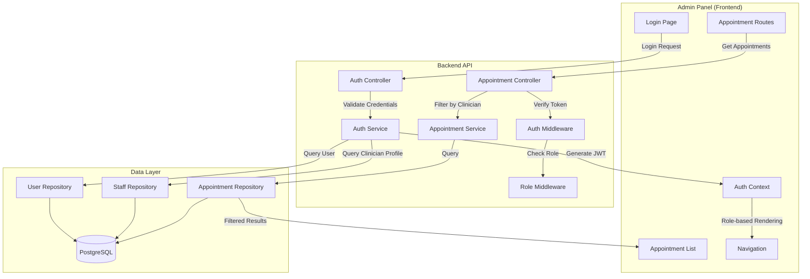

# Design Document: Clinician Admin Sign-In

## Overview

This feature enables clinicians to authenticate and access the admin panel using their username and password credentials. Clinicians will have a restricted view showing only their own appointments, maintaining data privacy and security. The implementation extends the existing authentication system to support clinician-specific access control while maintaining backward compatibility with existing admin and manager authentication flows.

### Key Design Goals

1. Enable clinician authentication using existing username/password credentials
2. Implement role-based access control to restrict clinicians to their own data
3. Filter appointments by clinician ID automatically
4. Adapt admin panel UI to show clinician-appropriate features only
5. Maintain backward compatibility with existing authentication methods

### Scope

**In Scope:**

- Backend authentication endpoint modifications to support clinician login
- JWT token enhancement to include clinician ID
- Appointment filtering by clinician ID
- Role-based middleware for access control
- Admin panel UI adaptation for clinician role

**Out of Scope:**

- New authentication methods (phone/OTP for clinicians)
- Clinician profile management features
- Appointment creation/modification by clinicians
- Multi-centre clinician support (clinicians work at their primary centre only)

## Architecture

### System Components



````

### Authentication Flow

```mermaid
sequenceDiagram
    participant C as Clinician
    participant LP as Login Page
    participant API as Auth API
    participant DB as Database
    participant JWT as JWT Service

    C->>LP: Enter username & password
    LP->>API: POST /api/auth/login/username-password
    API->>DB: Query users table (username, STAFF type)
    DB-->>API: User record
    API->>DB: Query clinician_profiles (user_id)
    DB-->>API: Clinician profile (id, primary_centre_id)

    alt Clinician profile exists
        API->>JWT: Generate token with clinicianId
        JWT-->>API: Access & Refresh tokens
        API-->>LP: {user, accessToken, refreshToken, clinicianId}
        LP->>LP: Store tokens & user data
        LP-->>C: Redirect to appointments
    else No clinician profile
        API-->>LP: 403 Access denied
        LP-->>C: Show error message
    end
````

````

### Appointment Filtering Flow

```mermaid
sequenceDiagram
    participant C as Clinician
    participant UI as Admin Panel
    participant API as Appointment API
    participant MW as Auth Middleware
    participant SVC as Appointment Service
    participant DB as Database

    C->>UI: Navigate to appointments
    UI->>API: GET /api/appointments (with JWT)
    API->>MW: Verify JWT token
    MW->>MW: Extract userId, roles, clinicianId
    MW-->>API: Authenticated request
    API->>SVC: Get appointments (userId, roles)

    alt User has CLINICIAN role
        SVC->>SVC: Apply clinician filter
        SVC->>DB: SELECT * WHERE clinician_id = ?
        DB-->>SVC: Clinician's appointments only
    else User has ADMIN/MANAGER role
        SVC->>DB: SELECT * (all appointments)
        DB-->>SVC: All appointments
    end

    SVC-->>API: Filtered appointments
    API-->>UI: Appointment list
    UI-->>C: Display appointments
````

````

## Components and Interfaces

### Backend Components

#### 1. Auth Service Enhancement

**File:** `backend/src/services/auth.services.ts`

**Modifications:**
- Enhance `loginWithUsernamePassword()` to query clinician profile
- Add clinician ID to JWT payload
- Return clinician information in auth response

**New Interface:**
```typescript
interface AuthResponse {
  user: {
    id: string;
    name: string;
    email: string | null;
    phone: string | null;
    username: string | null;
    role: string;
    avatar: string | null;
    centreIds: string[];
    isActive: boolean;
    createdAt: Date;
    updatedAt: Date;
    clinicianId?: number;  // NEW: Added for clinician users
  };
  accessToken: string;
  refreshToken: string;
}
````

#### 2. JWT Payload Enhancement

**File:** `backend/src/utils/jwt.ts`

**Modifications:**

```typescript
export interface JwtPayload {
  userId: number;
  phone: string;
  userType: "PATIENT" | "STAFF";
  roles: string[];
  clinicianId?: number; // NEW: Added for clinician role
}
```

#### 3. Appointment Repository Enhancement

**File:** `backend/src/repositories/appointment.repository.ts`

**New Method:**

```typescript
async findAppointmentsByClinicianId(
  clinicianId: number,
  filters?: {
    status?: AppointmentStatus[];
    startDate?: string;
    endDate?: string;
  }
): Promise<AppointmentWithDetails[]> {
  const conditions: string[] = [
    "a.clinician_id = $1",
    "a.is_active = TRUE",
    "a.scheduled_start_at >= NOW()"  // Only upcoming appointments
  ];

  const params: any[] = [clinicianId];
  let paramIndex = 2;

  if (filters?.status && filters.status.length > 0) {
    conditions.push(`a.status = ANY($${paramIndex}::text[])`);
    params.push(filters.status);
    paramIndex++;
  }

  if (filters?.startDate) {
    conditions.push(`DATE(a.scheduled_start_at) >= $${paramIndex}`);
    params.push(filters.startDate);
    paramIndex++;
  }

  if (filters?.endDate) {
    conditions.push(`DATE(a.scheduled_start_at) <= $${paramIndex}`);
    params.push(filters.endDate);
    paramIndex++;
  }

  const query = `
    SELECT
      a.*,
      p.full_name as patient_name,
      p.phone as patient_phone,
      p.email as patient_email,
      c.name as centre_name,
      c.city as centre_city,
      u.full_name as clinician_name
    FROM appointments a
    JOIN patient_profiles p ON a.patient_id = p.id
    JOIN centres c ON a.centre_id = c.id
    JOIN clinician_profiles cp ON a.clinician_id = cp.id
    JOIN users u ON cp.user_id = u.id
    WHERE ${conditions.join(" AND ")}
    ORDER BY a.scheduled_start_at ASC
  `;

  return db.any(query, params);
}
```

#### 4. Appointment Service Enhancement

**File:** `backend/src/services/appointment.services.ts`

**Modifications:**

```typescript
async getAppointments(
  authUser: JwtPayload,
  filters?: AppointmentFilters
): Promise<AppointmentWithDetails[]> {
  // Check if user is a clinician
  if (authUser.roles.includes('CLINICIAN')) {
    if (!authUser.clinicianId) {
      throw ApiError.forbidden('Clinician ID not found in token');
    }

    // Force filter by clinician ID
    return await appointmentRepository.findAppointmentsByClinicianId(
      authUser.clinicianId,
      filters
    );
  }

  // Admin/Manager users see all appointments
  return await appointmentRepository.findAppointments(filters);
}
```

#### 5. Role-Based Middleware

**File:** `backend/src/middlewares/role.middleware.ts` (NEW)

```typescript
import { Request, Response, NextFunction } from "express";
import { AuthRequest } from "./auth.middleware";
import { ApiError } from "../utils/apiError";

/**
 * Middleware to check if user has required role
 */
export const requireRole = (allowedRoles: string[]) => {
  return (req: AuthRequest, res: Response, next: NextFunction) => {
    if (!req.user) {
      throw ApiError.unauthorized("Authentication required");
    }

    const userRoles = req.user.roles || [];
    const hasRole = allowedRoles.some((role) => userRoles.includes(role));

    if (!hasRole) {
      throw ApiError.forbidden(
        `Access denied. Required roles: ${allowedRoles.join(", ")}`,
      );
    }

    next();
  };
};

/**
 * Middleware to ensure clinician can only access their own data
 */
export const enforceClinicianScope = (
  req: AuthRequest,
  res: Response,
  next: NextFunction,
) => {
  if (!req.user) {
    throw ApiError.unauthorized("Authentication required");
  }

  // Only enforce for clinician role
  if (req.user.roles.includes("CLINICIAN")) {
    // Ensure clinicianId exists in token
    if (!req.user.clinicianId) {
      throw ApiError.forbidden("Clinician ID not found");
    }

    // If request includes clinician_id parameter, verify it matches
    const requestedClinicianId =
      req.params.clinicianId || req.query.clinicianId || req.body.clinician_id;

    if (
      requestedClinicianId &&
      parseInt(requestedClinicianId) !== req.user.clinicianId
    ) {
      throw ApiError.forbidden("Access denied to other clinician's data");
    }
  }

  next();
};
```

### Frontend Components (Admin Panel)

#### 1. Auth Context Enhancement

**File:** `mibo-admin/src/contexts/AuthContext.tsx`

**Modifications:**

```typescript
interface User {
  id: string;
  name: string;
  email: string | null;
  phone: string | null;
  username: string | null;
  role: string;
  avatar: string | null;
  centreIds: string[];
  isActive: boolean;
  clinicianId?: number; // NEW
}

interface AuthContextType {
  user: User | null;
  isAuthenticated: boolean;
  isLoading: boolean;
  login: (credentials: LoginCredentials) => Promise<void>;
  logout: () => void;
  isClinician: boolean; // NEW: Helper to check if user is clinician
  isAdmin: boolean; // NEW: Helper to check if user is admin
}

// In AuthProvider implementation
const isClinician = user?.role === "CLINICIAN";
const isAdmin = user?.role === "ADMIN" || user?.role === "MANAGER";
```

#### 2. Navigation Component

**File:** `mibo-admin/src/components/Navigation.tsx`

**Modifications:**

```typescript
const Navigation: React.FC = () => {
  const { user, isClinician, isAdmin } = useAuth();

  return (
    <nav>
      <div className="user-info">
        <span>{user?.name}</span>
        <span className="role-badge">{user?.role}</span>
      </div>

      <ul className="nav-menu">
        {/* Always show appointments */}
        <li>
          <Link to="/appointments">
            {isClinician ? 'My Appointments' : 'Appointments'}
          </Link>
        </li>

        {/* Admin-only features */}
        {isAdmin && (
          <>
            <li><Link to="/clinicians">Clinicians</Link></li>
            <li><Link to="/patients">Patients</Link></li>
            <li><Link to="/centres">Centres</Link></li>
            <li><Link to="/staff">Staff</Link></li>
            <li><Link to="/settings">Settings</Link></li>
          </>
        )}

        {/* Profile available to all */}
        <li><Link to="/profile">Profile</Link></li>
      </ul>
    </nav>
  );
};
```

#### 3. Appointment List Component

**File:** `mibo-admin/src/components/Appointments/AppointmentList.tsx`

**Modifications:**

```typescript
const AppointmentList: React.FC = () => {
  const { user, isClinician } = useAuth();
  const [appointments, setAppointments] = useState<Appointment[]>([]);
  const [loading, setLoading] = useState(true);

  useEffect(() => {
    const fetchAppointments = async () => {
      try {
        // API automatically filters by clinician ID if user is clinician
        const response = await api.get('/api/appointments');
        setAppointments(response.data.data);
      } catch (error) {
        console.error('Failed to fetch appointments:', error);
      } finally {
        setLoading(false);
      }
    };

    fetchAppointments();
  }, []);

  return (
    <div className="appointment-list">
      <h1>{isClinician ? 'My Appointments' : 'All Appointments'}</h1>

      {appointments.length === 0 ? (
        <div className="empty-state">
          <p>No upcoming appointments</p>
        </div>
      ) : (
        <table>
          <thead>
            <tr>
              <th>Patient</th>
              <th>Date & Time</th>
              <th>Type</th>
              <th>Centre</th>
              <th>Status</th>
              <th>Actions</th>
            </tr>
          </thead>
          <tbody>
            {appointments.map(appointment => (
              <AppointmentRow
                key={appointment.id}
                appointment={appointment}
                isClinician={isClinician}
              />
            ))}
          </tbody>
        </table>
      )}
    </div>
  );
};
```

#### 4. Protected Route Component

**File:** `mibo-admin/src/components/ProtectedRoute.tsx` (NEW)

```typescript
import { Navigate } from 'react-router-dom';
import { useAuth } from '../contexts/AuthContext';

interface ProtectedRouteProps {
  children: React.ReactNode;
  allowedRoles?: string[];
}

const ProtectedRoute: React.FC<ProtectedRouteProps> = ({
  children,
  allowedRoles
}) => {
  const { isAuthenticated, user, isLoading } = useAuth();

  if (isLoading) {
    return <div>Loading...</div>;
  }

  if (!isAuthenticated) {
    return <Navigate to="/login" replace />;
  }

  if (allowedRoles && user && !allowedRoles.includes(user.role)) {
    return <Navigate to="/unauthorized" replace />;
  }

  return <>{children}</>;
};

export default ProtectedRoute;
```

## Data Models

### Database Schema

#### Users Table (Existing)

```sql
CREATE TABLE users (
  id SERIAL PRIMARY KEY,
  phone VARCHAR(15),
  email VARCHAR(255),
  username VARCHAR(100) UNIQUE,
  password_hash VARCHAR(255),
  full_name VARCHAR(255) NOT NULL,
  user_type VARCHAR(20) NOT NULL CHECK (user_type IN ('PATIENT', 'STAFF')),
  is_active BOOLEAN DEFAULT TRUE,
  created_at TIMESTAMP DEFAULT NOW(),
  updated_at TIMESTAMP DEFAULT NOW()
);
```

#### Clinician Profiles Table (Existing)

```sql
CREATE TABLE clinician_profiles (
  id SERIAL PRIMARY KEY,
  user_id INTEGER NOT NULL REFERENCES users(id),
  primary_centre_id INTEGER NOT NULL REFERENCES centres(id),
  specialization JSONB NOT NULL,
  registration_number VARCHAR(100),
  years_of_experience INTEGER DEFAULT 0,
  consultation_fee DECIMAL(10,2) DEFAULT 0,
  bio TEXT,
  consultation_modes JSONB,
  default_consultation_duration_minutes INTEGER DEFAULT 30,
  qualification JSONB DEFAULT '[]',
  expertise JSONB DEFAULT '[]',
  languages JSONB DEFAULT '["English"]',
  is_active BOOLEAN DEFAULT TRUE,
  created_at TIMESTAMP DEFAULT NOW(),
  updated_at TIMESTAMP DEFAULT NOW(),
  UNIQUE(user_id)
);
```

#### Appointments Table (Existing)

```sql
CREATE TABLE appointments (
  id SERIAL PRIMARY KEY,
  patient_id INTEGER NOT NULL REFERENCES patient_profiles(id),
  clinician_id INTEGER NOT NULL REFERENCES clinician_profiles(id),
  centre_id INTEGER NOT NULL REFERENCES centres(id),
  scheduled_start_at TIMESTAMP NOT NULL,
  scheduled_end_at TIMESTAMP NOT NULL,
  appointment_type VARCHAR(50) NOT NULL,
  status VARCHAR(50) NOT NULL,
  notes TEXT,
  is_active BOOLEAN DEFAULT TRUE,
  created_at TIMESTAMP DEFAULT NOW(),
  updated_at TIMESTAMP DEFAULT NOW()
);

CREATE INDEX idx_appointments_clinician ON appointments(clinician_id);
CREATE INDEX idx_appointments_scheduled_start ON appointments(scheduled_start_at);
CREATE INDEX idx_appointments_status ON appointments(status);
```

### TypeScript Interfaces

#### Enhanced JWT Payload

```typescript
interface JwtPayload {
  userId: number;
  phone: string;
  userType: "PATIENT" | "STAFF";
  roles: string[];
  clinicianId?: number; // Present only for clinician users
}
```

#### Enhanced Auth Response

```typescript
interface AuthResponse {
  user: {
    id: string;
    name: string;
    email: string | null;
    phone: string | null;
    username: string | null;
    role: string;
    avatar: string | null;
    centreIds: string[];
    isActive: boolean;
    createdAt: Date;
    updatedAt: Date;
    clinicianId?: number;
  };
  accessToken: string;
  refreshToken: string;
}
```

#### Appointment Filter

```typescript
interface AppointmentFilters {
  clinicianId?: number;
  patientId?: number;
  centreId?: number;
  status?: AppointmentStatus[];
  startDate?: string;
  endDate?: string;
  appointmentType?: string;
}
```

## Error Handling

### Error Scenarios and Responses

#### 1. Invalid Credentials

**Scenario:** User enters wrong username or password  
**Response:**

```json
{
  "success": false,
  "message": "Invalid credentials",
  "code": "INVALID_CREDENTIALS"
}
```

**HTTP Status:** 401 Unauthorized

#### 2. No Clinician Profile

**Scenario:** User is STAFF but doesn't have clinician profile  
**Response:**

```json
{
  "success": false,
  "message": "Access denied",
  "code": "ACCESS_DENIED"
}
```

**HTTP Status:** 403 Forbidden

#### 3. Inactive User

**Scenario:** User account is deactivated  
**Response:**

```json
{
  "success": false,
  "message": "Account is inactive. Please contact administrator.",
  "code": "ACCOUNT_INACTIVE"
}
```

**HTTP Status:** 403 Forbidden

#### 4. Unauthorized Data Access

**Scenario:** Clinician tries to access another clinician's appointments  
**Response:**

```json
{
  "success": false,
  "message": "Access denied to other clinician's data",
  "code": "FORBIDDEN"
}
```

**HTTP Status:** 403 Forbidden

#### 5. Missing Clinician ID in Token

**Scenario:** Token doesn't contain clinician ID for clinician user  
**Response:**

```json
{
  "success": false,
  "message": "Clinician ID not found in token",
  "code": "INVALID_TOKEN"
}
```

**HTTP Status:** 403 Forbidden

#### 6. Token Expired

**Scenario:** JWT access token has expired  
**Response:**

```json
{
  "success": false,
  "message": "Token expired. Please refresh your token.",
  "code": "TOKEN_EXPIRED"
}
```

**HTTP Status:** 401 Unauthorized

### Error Handling Strategy

1. **Authentication Errors:** Return generic "Invalid credentials" message to prevent username enumeration
2. **Authorization Errors:** Return specific error codes for debugging while maintaining security
3. **Token Errors:** Provide clear guidance for token refresh or re-authentication
4. **Data Access Errors:** Log attempts to access unauthorized data for security monitoring
5. **Frontend Error Display:** Show user-friendly messages with option to contact support

## Testing Strategy

### Unit Tests

#### Backend Unit Tests

1. **Auth Service Tests**
   - Test `loginWithUsernamePassword()` with valid clinician credentials
   - Test login rejection when user has no clinician profile
   - Test login rejection for inactive users
   - Test JWT token contains clinician ID for clinician users
   - Test JWT token doesn't contain clinician ID for non-clinician staff

2. **Appointment Repository Tests**
   - Test `findAppointmentsByClinicianId()` returns only clinician's appointments
   - Test filtering by status, date range
   - Test ordering by scheduled_start_at
   - Test empty result when no appointments exist

3. **Appointment Service Tests**
   - Test clinician users get filtered appointments
   - Test admin users get all appointments
   - Test error when clinician ID missing from token

4. **Role Middleware Tests**
   - Test `requireRole()` allows users with correct role
   - Test `requireRole()` blocks users without correct role
   - Test `enforceClinicianScope()` allows clinician to access own data
   - Test `enforceClinicianScope()` blocks clinician from accessing other's data

#### Frontend Unit Tests

1. **Auth Context Tests**
   - Test `isClinician` helper returns true for clinician role
   - Test `isAdmin` helper returns true for admin/manager roles
   - Test login stores clinician ID when present
   - Test logout clears all user data

2. **Navigation Component Tests**
   - Test clinician sees limited menu items
   - Test admin sees all menu items
   - Test role badge displays correctly

3. **Appointment List Tests**
   - Test displays "My Appointments" for clinicians
   - Test displays "All Appointments" for admins
   - Test empty state when no appointments
   - Test appointment data renders correctly

4. **Protected Route Tests**
   - Test redirects to login when not authenticated
   - Test redirects to unauthorized when role not allowed
   - Test renders children when authenticated with correct role

### Integration Tests

1. **End-to-End Authentication Flow**
   - Clinician logs in with username/password
   - Verify JWT token contains clinician ID
   - Verify user data includes clinician ID
   - Verify redirect to appointments page

2. **Appointment Filtering Flow**
   - Clinician requests appointments
   - Verify only their appointments are returned
   - Verify appointments include all required fields
   - Verify appointments are ordered by date

3. **Role-Based Access Control**
   - Clinician attempts to access admin-only endpoint
   - Verify 403 Forbidden response
   - Admin accesses same endpoint
   - Verify 200 OK response

4. **Backward Compatibility**
   - Admin logs in with phone + OTP
   - Verify existing flow works unchanged
   - Manager logs in with phone + password
   - Verify existing flow works unchanged

### Manual Testing Checklist

- [ ] Clinician can log in with username and password
- [ ] Clinician sees only their own appointments
- [ ] Clinician cannot access admin features
- [ ] Clinician can view appointment details
- [ ] Admin can still log in with all existing methods
- [ ] Admin sees all appointments
- [ ] Admin can access all features
- [ ] Error messages are user-friendly
- [ ] Token refresh works for clinician users
- [ ] Logout clears all session data
- [ ] Navigation menu adapts to user role
- [ ] Empty state displays when no appointments
- [ ] Appointment list loads quickly
- [ ] UI is responsive on different screen sizes

### Performance Testing

1. **Appointment Query Performance**
   - Test query performance with 1000+ appointments
   - Verify index on clinician_id is used
   - Verify response time < 500ms

2. **Authentication Performance**
   - Test login response time < 1 second
   - Test token verification overhead < 50ms

3. **Concurrent User Load**
   - Test 50 concurrent clinician logins
   - Test 100 concurrent appointment requests
   - Verify no degradation in response times

## Security Considerations

### Authentication Security

1. **Password Security**
   - Passwords are hashed using bcrypt with salt rounds = 10
   - Password hashes are never returned in API responses
   - Failed login attempts are logged for monitoring

2. **Token Security**
   - JWT tokens use HS256 algorithm with strong secret
   - Access tokens expire after 1 hour
   - Refresh tokens expire after 7 days
   - Tokens are stored in httpOnly cookies (recommended) or localStorage

3. **Session Management**
   - Refresh tokens are stored in database for revocation
   - Logout invalidates refresh token
   - Expired tokens are automatically cleaned up

### Authorization Security

1. **Role-Based Access Control**
   - All appointment endpoints verify user role
   - Clinician role automatically filters data by clinician ID
   - Admin/Manager roles have unrestricted access
   - Role checks happen on every request

2. **Data Isolation**
   - Clinicians can only access their own appointments
   - Clinician ID is enforced at database query level
   - URL parameter manipulation is prevented by middleware
   - Direct database queries include clinician_id filter

3. **API Security**
   - All endpoints require valid JWT token
   - CORS is configured to allow only admin panel domain
   - Rate limiting prevents brute force attacks
   - SQL injection prevented by parameterized queries

### Data Privacy

1. **Patient Data Protection**
   - Clinicians only see patients they have appointments with
   - Patient contact information is only shown for their appointments
   - Audit logs track all data access

2. **Clinician Data Protection**
   - Clinicians cannot view other clinicians' schedules
   - Clinician profile data is only accessible to admins
   - Appointment history is isolated by clinician

### Security Best Practices

1. **Input Validation**
   - All user inputs are validated and sanitized
   - Username and password length limits enforced
   - Special characters in passwords are allowed and encouraged

2. **Error Messages**
   - Generic error messages prevent information disclosure
   - Detailed errors are logged server-side only
   - No stack traces in production responses

3. **Logging and Monitoring**
   - Failed login attempts are logged with IP address
   - Unauthorized access attempts trigger alerts
   - Audit trail for all data modifications

4. **HTTPS Enforcement**
   - All API communication uses HTTPS
   - Tokens are never transmitted over HTTP
   - Secure flag set on cookies

## Implementation Notes

### Database Migrations

No database schema changes are required. The existing schema already supports:

- User authentication with username/password
- Clinician profiles linked to users
- Appointments linked to clinicians

### Backward Compatibility

The implementation maintains full backward compatibility:

- Existing authentication methods continue to work
- Admin and manager users are unaffected
- Existing API endpoints remain unchanged
- New functionality is additive only

### Configuration

**Environment Variables:**

```bash
# Existing JWT configuration (no changes needed)
JWT_ACCESS_SECRET=<secret>
JWT_REFRESH_SECRET=<secret>
JWT_ACCESS_EXPIRY=1h
JWT_REFRESH_EXPIRY=7d
```

### Deployment Considerations

1. **Zero-Downtime Deployment**
   - Backend changes are backward compatible
   - Frontend can be deployed independently
   - No database migrations required

2. **Rollback Strategy**
   - Backend rollback: revert to previous version
   - Frontend rollback: revert to previous build
   - No data cleanup needed

3. **Monitoring**
   - Monitor failed login attempts for clinicians
   - Track API response times for appointment queries
   - Alert on authorization errors

### Future Enhancements

1. **Multi-Centre Support**
   - Allow clinicians to work at multiple centres
   - Filter appointments by selected centre
   - Show centre selector in UI

2. **Appointment Management**
   - Allow clinicians to update appointment status
   - Enable clinicians to add notes
   - Support rescheduling requests

3. **Enhanced Filtering**
   - Filter by appointment type
   - Filter by date range
   - Search by patient name

4. **Mobile App Support**
   - Extend authentication to mobile app
   - Push notifications for appointments
   - Mobile-optimized appointment view

5. **Analytics Dashboard**
   - Show clinician's appointment statistics
   - Display patient satisfaction ratings
   - Track consultation completion rates
