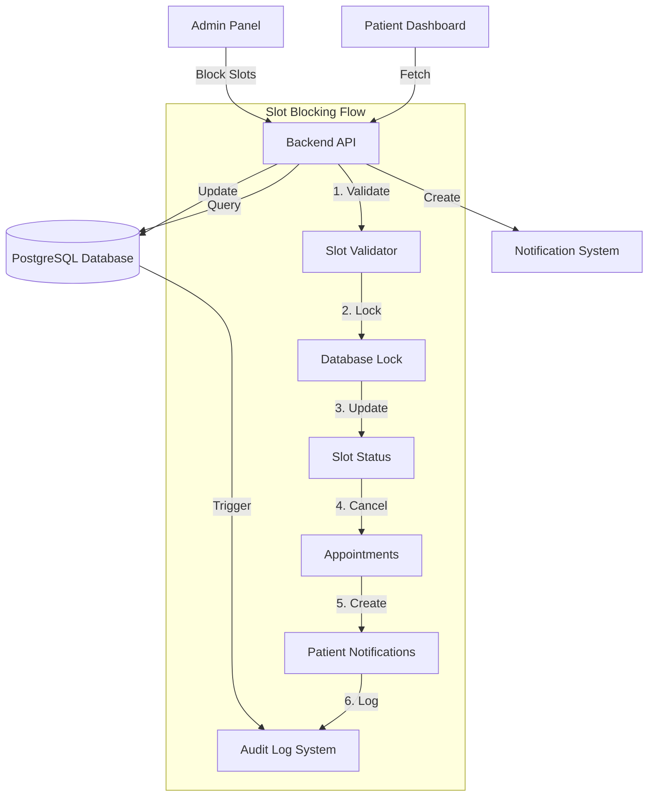
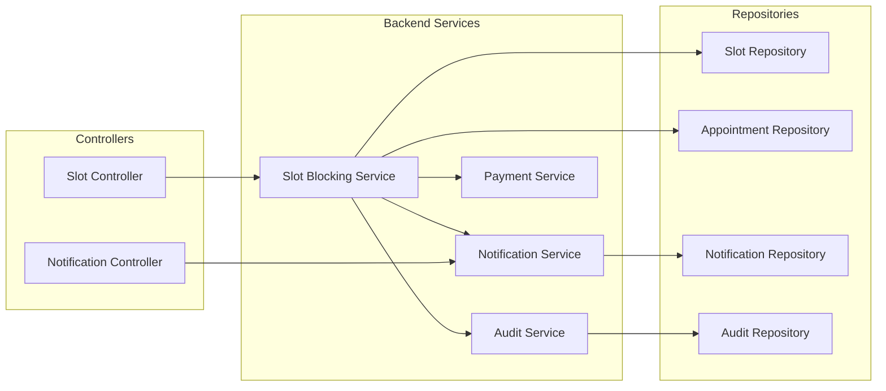

# Technical Design Document: Slot Blocking and Patient Notification System

## Overview

This document provides the technical design for implementing a slot blocking and patient notification feature in the healthcare appointment booking system. The feature enables administrators to block appointment slots when clinicians become unavailable and automatically notifies affected patients through their dashboard.

### System Context

The system consists of three main applications:

- **Backend API**: Node.js/Express with PostgreSQL database using pg-promise
- **Admin Panel**: React application (mibo-admin) for administrative operations
- **Patient Dashboard**: React application (mibo_version-2) for patient interactions

### Design Goals

1. Enable efficient slot blocking operations (individual, bulk, and day-level)
2. Maintain data consistency during concurrent operations
3. Provide real-time notifications to affected patients
4. Maintain comprehensive audit trails for accountability
5. Integrate seamlessly with existing appointment and payment systems
6. Support refund workflow integration

## Architecture

### High-Level Architecture



### Component Architecture



## Components and Interfaces

### Backend Components

#### 1. Slot Blocking Service

**Location**: `backend/src/services/slot-blocking.service.ts`

**Responsibilities**:

- Validate slot blocking requests
- Coordinate slot blocking operations
- Identify affected patients
- Trigger notification creation
- Handle concurrent access control
- Integrate with audit logging

**Key Methods**:

```typescript
interface SlotBlockingService {
  blockSlot(
    slotId: number,
    adminId: number,
    reason?: string,
  ): Promise<BlockedSlot>;
  blockMultipleSlots(
    slotIds: number[],
    adminId: number,
    reason?: string,
  ): Promise<BlockResult>;
  blockClinicianDay(
    clinicianId: number,
    date: string,
    adminId: number,
    reason?: string,
  ): Promise<BlockResult>;
  unblockSlot(slotId: number, adminId: number): Promise<void>;
  getAffectedPatients(slotIds: number[]): Promise<AffectedPatient[]>;
  getBlockedSlots(filters: BlockedSlotFilters): Promise<BlockedSlot[]>;
}
```

#### 2. Slot Repository

**Location**: `backend/src/repositories/slot.repository.ts`

**Responsibilities**:

- CRUD operations for slots
- Query blocked slots with filters
- Handle database-level locking
- Manage slot status transitions

**Key Methods**:

```typescript
interface SlotRepository {
  findSlotById(slotId: number): Promise<Slot | null>;
  findSlotsByIds(slotIds: number[]): Promise<Slot[]>;
  findSlotsByClinicianAndDate(
    clinicianId: number,
    date: string,
  ): Promise<Slot[]>;
  blockSlot(
    slotId: number,
    adminId: number,
    reason: string,
  ): Promise<BlockedSlot>;
  unblockSlot(slotId: number, adminId: number): Promise<void>;
  findBlockedSlots(filters: BlockedSlotFilters): Promise<BlockedSlot[]>;
  lockSlotForUpdate(slotId: number): Promise<Slot>;
}
```

#### 3. Patient Notification Repository (Extended)

**Location**: `backend/src/repositories/patient-notification.repository.ts`

**Responsibilities**:

- Create patient dashboard notifications
- Query notifications by patient
- Mark notifications as read
- Filter notifications by date range

**Key Methods**:

```typescript
interface PatientNotificationRepository {
  createNotification(
    data: CreateNotificationData,
  ): Promise<PatientNotification>;
  getNotificationsByPatient(
    patientId: number,
    filters?: NotificationFilters,
  ): Promise<PatientNotification[]>;
  markAsRead(notificationId: number, patientId: number): Promise<void>;
  getUnreadCount(patientId: number): Promise<number>;
}
```

#### 4. Audit Repository

**Location**: `backend/src/repositories/audit.repository.ts`

**Responsibilities**:

- Log all slot blocking/unblocking actions
- Query audit history
- Support compliance and accountability

**Key Methods**:

```typescript
interface AuditRepository {
  logSlotAction(data: SlotAuditData): Promise<void>;
  getSlotHistory(slotId: number): Promise<AuditEntry[]>;
  getAdminActions(
    adminId: number,
    filters?: AuditFilters,
  ): Promise<AuditEntry[]>;
}
```

### Frontend Components

#### Admin Panel Components

**Location**: `mibo-admin/src/components/slot-management/`

1. **SlotBlockingPanel**: Main interface for blocking operations
2. **SlotSelector**: UI for selecting individual or multiple slots
3. **ClinicianDayBlocker**: Interface for blocking entire days
4. **AffectedPatientsModal**: Display patients affected by blocking
5. **BlockedSlotsTable**: View and manage blocked slots
6. **SlotFilters**: Filter and search blocked slots

#### Patient Dashboard Components

**Location**: `mibo_version-2/src/components/notifications/`

1. **NotificationBell**: Header notification indicator
2. **NotificationPanel**: Dropdown panel showing recent notifications
3. **NotificationList**: Full notification history page
4. **NotificationItem**: Individual notification display
5. **NotificationFilters**: Date range and status filters

## Data Models

### Database Schema

#### 1. blocked_slots Table

```sql
CREATE TABLE blocked_slots (
  id SERIAL PRIMARY KEY,
  clinician_id INTEGER NOT NULL REFERENCES clinician_profiles(id),
  centre_id INTEGER NOT NULL REFERENCES centres(id),
  blocked_date DATE NOT NULL,
  start_time TIME NOT NULL,
  end_time TIME NOT NULL,
  reason TEXT DEFAULT 'Clinician unavailable',
  blocked_by_admin_id INTEGER NOT NULL REFERENCES users(id),
  blocked_at TIMESTAMP NOT NULL DEFAULT NOW(),
  unblocked_by_admin_id INTEGER REFERENCES users(id),
  unblocked_at TIMESTAMP,
  is_blocked BOOLEAN NOT NULL DEFAULT TRUE,
  created_at TIMESTAMP NOT NULL DEFAULT NOW(),
  updated_at TIMESTAMP NOT NULL DEFAULT NOW(),

  CONSTRAINT unique_slot_blocking UNIQUE (clinician_id, centre_id, blocked_date, start_time, end_time),
  CONSTRAINT valid_time_range CHECK (start_time < end_time),
  CONSTRAINT no_past_blocking CHECK (blocked_date >= CURRENT_DATE)
);

CREATE INDEX idx_blocked_slots_clinician_date ON blocked_slots(clinician_id, blocked_date) WHERE is_blocked = TRUE;
CREATE INDEX idx_blocked_slots_centre ON blocked_slots(centre_id) WHERE is_blocked = TRUE;
CREATE INDEX idx_blocked_slots_date_range ON blocked_slots(blocked_date) WHERE is_blocked = TRUE;
CREATE INDEX idx_blocked_slots_admin ON blocked_slots(blocked_by_admin_id);
```

#### 2. patient_notifications Table

```sql
CREATE TABLE patient_notifications (
  id SERIAL PRIMARY KEY,
  patient_id INTEGER NOT NULL REFERENCES patient_profiles(id),
  notification_type VARCHAR(50) NOT NULL,
  title VARCHAR(255) NOT NULL,
  message TEXT NOT NULL,
  appointment_id INTEGER REFERENCES appointments(id),
  blocked_slot_id INTEGER REFERENCES blocked_slots(id),
  metadata JSONB,
  is_read BOOLEAN NOT NULL DEFAULT FALSE,
  read_at TIMESTAMP,
  created_at TIMESTAMP NOT NULL DEFAULT NOW(),
  updated_at TIMESTAMP NOT NULL DEFAULT NOW()
);

CREATE INDEX idx_patient_notifications_patient ON patient_notifications(patient_id, created_at DESC);
CREATE INDEX idx_patient_notifications_unread ON patient_notifications(patient_id) WHERE is_read = FALSE;
CREATE INDEX idx_patient_notifications_type ON patient_notifications(notification_type);
CREATE INDEX idx_patient_notifications_appointment ON patient_notifications(appointment_id);
```

#### 3. slot_blocking_audit Table

```sql
CREATE TABLE slot_blocking_audit (
  id SERIAL PRIMARY KEY,
  blocked_slot_id INTEGER NOT NULL REFERENCES blocked_slots(id),
  action_type VARCHAR(20) NOT NULL CHECK (action_type IN ('BLOCK', 'UNBLOCK')),
  admin_id INTEGER NOT NULL REFERENCES users(id),
  reason TEXT,
  affected_appointment_ids INTEGER[],
  affected_patient_count INTEGER NOT NULL DEFAULT 0,
  metadata JSONB,
  created_at TIMESTAMP NOT NULL DEFAULT NOW()
);

CREATE INDEX idx_slot_audit_blocked_slot ON slot_blocking_audit(blocked_slot_id);
CREATE INDEX idx_slot_audit_admin ON slot_blocking_audit(admin_id);
CREATE INDEX idx_slot_audit_action ON slot_blocking_audit(action_type);
CREATE INDEX idx_slot_audit_created ON slot_blocking_audit(created_at DESC);
```

#### 4. Appointment Status Extension

Add new status to existing appointments table:

```sql
-- Add new appointment status
ALTER TYPE appointment_status ADD VALUE IF NOT EXISTS 'CANCELLED_BY_ADMIN';

-- Add columns for refund tracking
ALTER TABLE appointments
  ADD COLUMN IF NOT EXISTS refund_eligible BOOLEAN DEFAULT FALSE,
  ADD COLUMN IF NOT EXISTS refund_status VARCHAR(20) CHECK (refund_status IN ('PENDING', 'PROCESSED', 'COMPLETED', 'NOT_APPLICABLE')),
  ADD COLUMN IF NOT EXISTS refund_initiated_at TIMESTAMP,
  ADD COLUMN IF NOT EXISTS blocked_slot_id INTEGER REFERENCES blocked_slots(id);

CREATE INDEX idx_appointments_refund_status ON appointments(refund_status) WHERE refund_eligible = TRUE;
CREATE INDEX idx_appointments_blocked_slot ON appointments(blocked_slot_id);
```

### TypeScript Interfaces

#### Backend Types

**Location**: `backend/src/types/slot-blocking.types.ts`

```typescript
export interface BlockedSlot {
  id: number;
  clinician_id: number;
  centre_id: number;
  blocked_date: string;
  start_time: string;
  end_time: string;
  reason: string;
  blocked_by_admin_id: number;
  blocked_at: Date;
  unblocked_by_admin_id: number | null;
  unblocked_at: Date | null;
  is_blocked: boolean;
  created_at: Date;
  updated_at: Date;
}

export interface BlockSlotRequest {
  clinician_id: number;
  centre_id: number;
  date: string;
  start_time: string;
  end_time: string;
  reason?: string;
}

export interface BlockMultipleSlotsRequest {
  slots: BlockSlotRequest[];
  reason?: string;
}

export interface BlockClinicianDayRequest {
  clinician_id: number;
  centre_id: number;
  date: string;
  reason?: string;
}

export interface BlockResult {
  success: boolean;
  blocked_count: number;
  failed_count: number;
  blocked_slot_ids: number[];
  failed_slots: Array<{
    slot: BlockSlotRequest;
    error: string;
  }>;
  affected_patients: AffectedPatient[];
}

export interface AffectedPatient {
  patient_id: number;
  patient_name: string;
  patient_phone: string;
  patient_email: string;
  appointment_id: number;
  appointment_time: string;
  clinician_name: string;
  payment_status: string | null;
  refund_eligible: boolean;
}

export interface PatientNotification {
  id: number;
  patient_id: number;
  notification_type: NotificationType;
  title: string;
  message: string;
  appointment_id: number | null;
  blocked_slot_id: number | null;
  metadata: Record<string, any> | null;
  is_read: boolean;
  read_at: Date | null;
  created_at: Date;
  updated_at: Date;
}

export type NotificationType =
  | "APPOINTMENT_BLOCKED"
  | "APPOINTMENT_CANCELLED"
  | "REFUND_INITIATED"
  | "GENERAL";

export interface SlotAuditData {
  blocked_slot_id: number;
  action_type: "BLOCK" | "UNBLOCK";
  admin_id: number;
  reason?: string;
  affected_appointment_ids: number[];
  affected_patient_count: number;
  metadata?: Record<string, any>;
}

export interface BlockedSlotFilters {
  clinician_id?: number;
  centre_id?: number;
  date_from?: string;
  date_to?: string;
  is_blocked?: boolean;
  blocked_by_admin_id?: number;
}
```

#### Frontend Types

**Location**: `mibo-admin/src/types/slot-blocking.ts` and `mibo_version-2/src/types/notifications.ts`

```typescript
// Admin Panel Types
export interface SlotBlockingFormData {
  clinicianId: number;
  centreId: number;
  date: string;
  startTime: string;
  endTime: string;
  reason?: string;
}

export interface AffectedPatientDisplay {
  patientName: string;
  appointmentTime: string;
  clinicianName: string;
  paymentStatus: string;
  refundEligible: boolean;
}

// Patient Dashboard Types
export interface NotificationDisplay {
  id: number;
  title: string;
  message: string;
  type:
    | "APPOINTMENT_BLOCKED"
    | "APPOINTMENT_CANCELLED"
    | "REFUND_INITIATED"
    | "GENERAL";
  isRead: boolean;
  createdAt: string;
  appointmentDetails?: {
    date: string;
    time: string;
    clinicianName: string;
  };
}
```

### API Specifications

#### Slot Blocking Endpoints

**Base Path**: `/api/admin/slots`

##### 1. Block Single Slot

```
POST /api/admin/slots/block
Authorization: Bearer <admin_token>
Content-Type: application/json

Request Body:
{
  "clinician_id": 5,
  "centre_id": 2,
  "date": "2024-02-15",
  "start_time": "10:00:00",
  "end_time": "10:30:00",
  "reason": "Doctor on emergency leave"
}

Response (200):
{
  "success": true,
  "data": {
    "blocked_slot": {
      "id": 123,
      "clinician_id": 5,
      "centre_id": 2,
      "blocked_date": "2024-02-15",
      "start_time": "10:00:00",
      "end_time": "10:30:00",
      "reason": "Doctor on emergency leave",
      "blocked_by_admin_id": 1,
      "blocked_at": "2024-02-10T14:30:00Z",
      "is_blocked": true
    },
    "affected_patients": [
      {
        "patient_id": 42,
        "patient_name": "John Doe",
        "patient_phone": "+919876543210",
        "appointment_id": 567,
        "appointment_time": "2024-02-15T10:00:00Z",
        "clinician_name": "Dr. Smith",
        "payment_status": "COMPLETED",
        "refund_eligible": true
      }
    ]
  }
}

Error Response (400):
{
  "success": false,
  "error": {
    "code": "PAST_SLOT_BLOCKING",
    "message": "Cannot block slots in the past"
  }
}
```

##### 2. Block Multiple Slots

```
POST /api/admin/slots/block-multiple
Authorization: Bearer <admin_token>
Content-Type: application/json

Request Body:
{
  "slots": [
    {
      "clinician_id": 5,
      "centre_id": 2,
      "date": "2024-02-15",
      "start_time": "10:00:00",
      "end_time": "10:30:00"
    },
    {
      "clinician_id": 5,
      "centre_id": 2,
      "date": "2024-02-15",
      "start_time": "10:30:00",
      "end_time": "11:00:00"
    }
  ],
  "reason": "Doctor on emergency leave"
}

Response (200):
{
  "success": true,
  "data": {
    "blocked_count": 2,
    "failed_count": 0,
    "blocked_slot_ids": [123, 124],
    "failed_slots": [],
    "affected_patients": [...]
  }
}
```

##### 3. Block Clinician Day

```
POST /api/admin/slots/block-day
Authorization: Bearer <admin_token>
Content-Type: application/json

Request Body:
{
  "clinician_id": 5,
  "centre_id": 2,
  "date": "2024-02-15",
  "reason": "Doctor on emergency leave"
}

Response (200):
{
  "success": true,
  "data": {
    "blocked_count": 16,
    "failed_count": 0,
    "blocked_slot_ids": [123, 124, 125, ...],
    "affected_patients": [...]
  }
}
```

##### 4. Unblock Slot

```
POST /api/admin/slots/unblock/:slotId
Authorization: Bearer <admin_token>

Response (200):
{
  "success": true,
  "message": "Slot unblocked successfully"
}
```

##### 5. Get Blocked Slots

```
GET /api/admin/slots/blocked?clinician_id=5&date_from=2024-02-01&date_to=2024-02-28
Authorization: Bearer <admin_token>

Response (200):
{
  "success": true,
  "data": {
    "blocked_slots": [
      {
        "id": 123,
        "clinician_id": 5,
        "clinician_name": "Dr. Smith",
        "centre_id": 2,
        "centre_name": "Main Clinic",
        "blocked_date": "2024-02-15",
        "start_time": "10:00:00",
        "end_time": "10:30:00",
        "reason": "Doctor on emergency leave",
        "blocked_by_admin_name": "Admin User",
        "blocked_at": "2024-02-10T14:30:00Z",
        "is_blocked": true
      }
    ],
    "total": 1
  }
}
```

##### 6. Get Affected Patients (Preview)

```
POST /api/admin/slots/affected-patients
Authorization: Bearer <admin_token>
Content-Type: application/json

Request Body:
{
  "slots": [
    {
      "clinician_id": 5,
      "centre_id": 2,
      "date": "2024-02-15",
      "start_time": "10:00:00",
      "end_time": "10:30:00"
    }
  ]
}

Response (200):
{
  "success": true,
  "data": {
    "affected_patients": [...],
    "total_count": 3
  }
}
```

#### Patient Notification Endpoints

**Base Path**: `/api/patient/notifications`

##### 1. Get Patient Notifications

```
GET /api/patient/notifications?limit=20&offset=0&unread_only=false
Authorization: Bearer <patient_token>

Response (200):
{
  "success": true,
  "data": {
    "notifications": [
      {
        "id": 456,
        "title": "Appointment Cancelled",
        "message": "Your appointment with Dr. Smith on Feb 15, 2024 at 10:00 AM has been cancelled due to Doctor on emergency leave. Please reschedule at your convenience.",
        "type": "APPOINTMENT_BLOCKED",
        "is_read": false,
        "created_at": "2024-02-10T14:30:00Z",
        "appointment_details": {
          "appointment_id": 567,
          "date": "2024-02-15",
          "time": "10:00:00",
          "clinician_name": "Dr. Smith",
          "refund_eligible": true
        }
      }
    ],
    "total": 5,
    "unread_count": 2
  }
}
```

##### 2. Mark Notification as Read

```
PUT /api/patient/notifications/:notificationId/read
Authorization: Bearer <patient_token>

Response (200):
{
  "success": true,
  "message": "Notification marked as read"
}
```

##### 3. Get Unread Count

```
GET /api/patient/notifications/unread-count
Authorization: Bearer <patient_token>

Response (200):
{
  "success": true,
  "data": {
    "unread_count": 2
  }
}
```

## Correctness Properties

_A property is a characteristic or behavior that should hold true across all valid executions of a system—essentially, a formal statement about what the system should do. Properties serve as the bridge between human-readable specifications and machine-verifiable correctness guarantees._

### Property Reflection

After analyzing all acceptance criteria, I identified the following redundancies:

- Properties 1.3, 2.3, and 3.4 all require recording timestamp and admin ID for blocked slots - these can be combined into one comprehensive property
- Properties 5.2 and 6.3 both require notification content to include appointment details - 5.2 covers this
- Properties 10.2 and 10.3 both cover audit log data completeness - can be combined
- Properties 12.1 and 12.4 both cover refund eligibility flagging - can be combined

### Property 1: Slot Blocking Persistence

_For any_ slot that is successfully blocked, querying the database should return a blocked_slots record with is_blocked = true, and the record should contain the blocking timestamp, administrator ID, clinician ID, centre ID, date, and time range.

**Validates: Requirements 1.2, 1.3, 2.3, 3.4**

### Property 2: Blocked Slot Booking Prevention

_For any_ slot that is marked as blocked in the database, any attempt to create a new appointment for that slot should be rejected with an appropriate error.

**Validates: Requirements 1.4**

### Property 3: Slot Attribute Preservation

_For any_ slot, blocking the slot should not modify its clinician_id, centre_id, blocked_date, start_time, or end_time values.

**Validates: Requirements 1.5**

### Property 4: Bulk Blocking Partial Failure Handling

_For any_ bulk blocking operation where some slots fail validation, the system should successfully block all valid slots and return a list of failed slots with their error reasons, ensuring that one failure does not prevent other slots from being blocked.

**Validates: Requirements 2.4**

### Property 5: Clinician Day Blocking Completeness

_For any_ clinician and date, after performing a day blocking operation, all slots for that clinician on that date (regardless of booking status) should have is_blocked = true in the database.

**Validates: Requirements 3.2, 3.3**

### Property 6: Affected Patient Identification

_For any_ set of slots being blocked, the system should return a list of affected patients that includes exactly those patients who have appointments with status in ('BOOKED', 'CONFIRMED', 'RESCHEDULED') on those slots, and each patient record should include patient_name, appointment_time, and contact_information.

**Validates: Requirements 4.1, 4.2, 4.3**

### Property 7: Patient Notification Creation

_For any_ booked slot that is blocked, the system should create a patient_notification record for the patient associated with that appointment, with is_read = false and a created_at timestamp.

**Validates: Requirements 5.1, 5.3, 5.4**

### Property 8: Notification Content Completeness

_For any_ notification created due to slot blocking, the notification message should contain the original appointment date, time, and clinician name from the affected appointment.

**Validates: Requirements 5.2**

### Property 9: Unread Notification Retrieval

_For any_ patient with unread notifications (is_read = false), querying the patient's notifications should return all unread notifications for that patient.

**Validates: Requirements 6.1**

### Property 10: Notification Read Status Transition

_For any_ notification that is viewed by a patient, the notification's is_read field should transition from false to true, and read_at should be set to the current timestamp.

**Validates: Requirements 6.4**

### Property 11: Appointment Cancellation on Blocking

_For any_ appointment on a slot that is blocked, the appointment's status should be updated to 'CANCELLED_BY_ADMIN' and the updated_at timestamp should be set.

**Validates: Requirements 7.1, 7.3**

### Property 12: Appointment Detail Preservation

_For any_ appointment that is cancelled due to slot blocking, the appointment's patient_id, clinician_id, scheduled_start_at, and scheduled_end_at should remain unchanged.

**Validates: Requirements 7.2**

### Property 13: Payment Status Independence

_For any_ appointment that is cancelled due to slot blocking, the appointment's payment-related fields (payment_status, payment_amount) should remain unchanged.

**Validates: Requirements 7.4**

### Property 14: Blocking Reason Storage

_For any_ slot blocking operation where a reason is provided, the blocked_slots record should contain that exact reason in the reason field.

**Validates: Requirements 8.2**

### Property 15: Blocking Reason in Notification

_For any_ notification created for a blocked slot where a blocking reason was provided, the notification message should include that reason.

**Validates: Requirements 8.3**

### Property 16: Unblocking Restores Availability

_For any_ blocked slot that is unblocked, the slot's is_blocked field should be set to false, unblocked_at should be set to the current timestamp, and unblocked_by_admin_id should be set to the admin performing the action.

**Validates: Requirements 9.2, 9.4**

### Property 17: Unblocked Slot Booking Availability

_For any_ slot that has been unblocked (is_blocked = false), new appointment booking attempts for that slot should succeed (assuming no other conflicts).

**Validates: Requirements 9.3**

### Property 18: Unblocking Does Not Restore Appointments

_For any_ appointment that was cancelled due to slot blocking, unblocking the slot should not change the appointment's status from 'CANCELLED_BY_ADMIN'.

**Validates: Requirements 9.5**

### Property 19: Audit Log Creation

_For any_ slot blocking or unblocking action, an audit log entry should be created in slot_blocking_audit with action_type, admin_id, blocked_slot_id, timestamp, affected_appointment_ids, and reason.

**Validates: Requirements 10.1, 10.2, 10.3**

### Property 20: Audit History Completeness

_For any_ slot that has been blocked or unblocked, querying the audit history for that slot should return all blocking and unblocking actions performed on it in chronological order.

**Validates: Requirements 10.4**

### Property 21: Past Slot Blocking Rejection

_For any_ slot with a date and time in the past (before current timestamp), attempting to block that slot should be rejected with an error indicating past slots cannot be blocked.

**Validates: Requirements 11.1**

### Property 22: Refund Eligibility Flagging

_For any_ appointment with payment_status = 'COMPLETED' that is cancelled due to slot blocking, the appointment's refund_eligible field should be set to true and refund_status should be set to 'PENDING'.

**Validates: Requirements 12.1, 12.4**

### Property 23: Refund Information in Notification

_For any_ notification created for an appointment where refund_eligible = true, the notification message or metadata should include refund information.

**Validates: Requirements 12.2, 12.3**

### Property 24: Blocked Slot Filtering

_For any_ query to retrieve blocked slots with filters (clinician_id, date_range, blocking_status), the returned results should include only slots matching all specified filter criteria.

**Validates: Requirements 13.2**

### Property 25: Blocked Slot Search

_For any_ search query by patient name or appointment ID, the returned blocked slots should include only those slots where the associated appointment matches the search criteria.

**Validates: Requirements 13.3**

### Property 26: Blocked Slot Result Completeness

_For any_ blocked slot returned in query results, the result should include the blocking reason and blocked_by_admin_id (with admin name via join).

**Validates: Requirements 13.4**

### Property 27: Notification Read/Unread Retrieval

_For any_ patient, querying their notifications without filters should return both read (is_read = true) and unread (is_read = false) notifications.

**Validates: Requirements 14.1**

### Property 28: Notification Date Range Filtering

_For any_ notification query with a date range filter, the returned notifications should have created_at timestamps within the specified range (inclusive).

**Validates: Requirements 14.2**

### Property 29: Notification Chronological Ordering

_For any_ patient's notification history query, the returned notifications should be ordered by created_at in descending order (most recent first).

**Validates: Requirements 14.4**

### Property 30: Concurrent Blocking Prevention

_For any_ slot, when multiple concurrent blocking requests are made for the same slot, only one request should succeed and create a blocked_slots record, while others should fail with a concurrency error.

**Validates: Requirements 15.1**

### Property 31: Concurrent Block-Book Race Condition

_For any_ slot, if a blocking operation and a booking operation are attempted concurrently, either the block succeeds and the booking fails, or the booking succeeds and the block fails, but never both succeed.

**Validates: Requirements 15.2**

## Error Handling

### Error Categories

#### 1. Validation Errors (400 Bad Request)

- **PAST_SLOT_BLOCKING**: Attempt to block a slot in the past
- **INVALID_TIME_RANGE**: start_time >= end_time
- **INVALID_DATE_FORMAT**: Date not in YYYY-MM-DD format
- **MISSING_REQUIRED_FIELDS**: Required fields not provided
- **INVALID_CLINICIAN**: Clinician ID does not exist or is inactive
- **INVALID_CENTRE**: Centre ID does not exist or is inactive

#### 2. Conflict Errors (409 Conflict)

- **SLOT_ALREADY_BLOCKED**: Slot is already blocked
- **CONCURRENT_MODIFICATION**: Another operation modified the slot simultaneously
- **SLOT_NOT_BLOCKED**: Attempt to unblock a slot that is not blocked

#### 3. Authorization Errors (403 Forbidden)

- **INSUFFICIENT_PERMISSIONS**: User does not have admin privileges
- **UNAUTHORIZED_CENTRE_ACCESS**: Admin does not have access to the specified centre

#### 4. Not Found Errors (404 Not Found)

- **SLOT_NOT_FOUND**: Specified slot does not exist
- **NOTIFICATION_NOT_FOUND**: Specified notification does not exist
- **APPOINTMENT_NOT_FOUND**: Specified appointment does not exist

#### 5. Server Errors (500 Internal Server Error)

- **DATABASE_ERROR**: Database operation failed
- **NOTIFICATION_CREATION_FAILED**: Failed to create patient notification
- **AUDIT_LOG_FAILED**: Failed to create audit log entry

### Error Response Format

All errors follow a consistent format:

```typescript
{
  success: false,
  error: {
    code: string,
    message: string,
    details?: any
  }
}
```

### Error Handling Strategy

1. **Validation Layer**: Validate all inputs before database operations
2. **Transaction Management**: Use database transactions for multi-step operations
3. **Rollback on Failure**: If notification creation fails, rollback slot blocking
4. **Partial Success Reporting**: For bulk operations, report both successes and failures
5. **Audit Logging**: Log all errors in audit trail for debugging
6. **User-Friendly Messages**: Return clear, actionable error messages to users

### Critical Error Scenarios

#### Scenario 1: Notification Creation Failure

```typescript
// If notification creation fails after blocking slot
// Strategy: Log error but don't rollback blocking
// Rationale: Slot blocking is critical, notification can be retried
try {
  await blockSlot(slotId);
  await createNotification(patientId);
} catch (notificationError) {
  logger.error("Notification creation failed", {
    slotId,
    patientId,
    error: notificationError,
  });
  // Continue - slot is blocked, notification can be manually created
}
```

#### Scenario 2: Partial Bulk Blocking Failure

```typescript
// For bulk operations, continue on individual failures
const results = {
  blocked: [],
  failed: [],
};

for (const slot of slots) {
  try {
    const blocked = await blockSlot(slot);
    results.blocked.push(blocked);
  } catch (error) {
    results.failed.push({ slot, error: error.message });
  }
}

return results; // Return both successes and failures
```

#### Scenario 3: Concurrent Modification

```typescript
// Use database-level locking to prevent race conditions
try {
  await db.tx(async (t) => {
    const slot = await t.one("SELECT * FROM slots WHERE id = $1 FOR UPDATE", [
      slotId,
    ]);
    if (slot.is_blocked) {
      throw new ConflictError("SLOT_ALREADY_BLOCKED");
    }
    await t.none("UPDATE slots SET is_blocked = true WHERE id = $1", [slotId]);
  });
} catch (error) {
  if (error.code === "SLOT_ALREADY_BLOCKED") {
    return { success: false, error: "Slot is already blocked" };
  }
  throw error;
}
```

## Testing Strategy

### Dual Testing Approach

This feature requires both unit tests and property-based tests for comprehensive coverage:

- **Unit Tests**: Verify specific examples, edge cases, and error conditions
- **Property Tests**: Verify universal properties across all inputs using randomized testing

### Property-Based Testing

**Library**: fast-check (already in backend dependencies)

**Configuration**:

- Minimum 100 iterations per property test
- Each test tagged with feature name and property number
- Tag format: `Feature: slot-blocking-notification, Property {number}: {property_text}`

**Test Organization**:

```
backend/src/__tests__/
  slot-blocking/
    slot-blocking.property.test.ts    # Properties 1-5
    notification.property.test.ts      # Properties 6-10
    appointment.property.test.ts       # Properties 11-13
    audit.property.test.ts             # Properties 19-20
    refund.property.test.ts            # Properties 22-23
    query.property.test.ts             # Properties 24-29
    concurrency.property.test.ts       # Properties 30-31
```

**Example Property Test**:

```typescript
import fc from "fast-check";

describe("Feature: slot-blocking-notification, Property 1: Slot Blocking Persistence", () => {
  it("should persist blocked slot with all required fields", async () => {
    await fc.assert(
      fc.asyncProperty(
        fc
          .record({
            clinician_id: fc.integer({ min: 1, max: 100 }),
            centre_id: fc.integer({ min: 1, max: 10 }),
            date: fc.date({ min: new Date(), max: new Date("2025-12-31") }),
            start_time: fc.integer({ min: 8, max: 17 }),
            end_time: fc.integer({ min: 9, max: 18 }),
            admin_id: fc.integer({ min: 1, max: 10 }),
            reason: fc.string({ minLength: 0, maxLength: 200 }),
          })
          .filter((data) => data.start_time < data.end_time),
        async (slotData) => {
          // Block the slot
          const blockedSlot = await slotBlockingService.blockSlot(
            slotData.clinician_id,
            slotData.centre_id,
            slotData.date.toISOString().split("T")[0],
            `${slotData.start_time}:00:00`,
            `${slotData.end_time}:00:00`,
            slotData.admin_id,
            slotData.reason,
          );

          // Query the database
          const dbSlot = await slotRepository.findSlotById(blockedSlot.id);

          // Verify all required fields are present
          expect(dbSlot).toBeDefined();
          expect(dbSlot.is_blocked).toBe(true);
          expect(dbSlot.blocked_by_admin_id).toBe(slotData.admin_id);
          expect(dbSlot.blocked_at).toBeDefined();
          expect(dbSlot.clinician_id).toBe(slotData.clinician_id);
          expect(dbSlot.centre_id).toBe(slotData.centre_id);
        },
      ),
      { numRuns: 100 },
    );
  });
});
```

### Unit Testing

**Focus Areas**:

- Specific edge cases (empty reason defaults to "Clinician unavailable")
- Error conditions (past slot blocking rejection)
- Integration points (payment service integration)
- API endpoint validation

**Test Organization**:

```
backend/src/__tests__/
  slot-blocking/
    slot-blocking.service.test.ts
    slot-blocking.controller.test.ts
    slot.repository.test.ts
    patient-notification.repository.test.ts
    audit.repository.test.ts
```

**Example Unit Test**:

```typescript
describe("SlotBlockingService", () => {
  describe("blockSlot", () => {
    it("should use default reason when no reason provided", async () => {
      const result = await slotBlockingService.blockSlot(
        clinicianId,
        centreId,
        "2024-03-15",
        "10:00:00",
        "10:30:00",
        adminId,
        // No reason provided
      );

      expect(result.reason).toBe("Clinician unavailable");
    });

    it("should reject blocking past slots", async () => {
      const pastDate = "2023-01-01";

      await expect(
        slotBlockingService.blockSlot(
          clinicianId,
          centreId,
          pastDate,
          "10:00:00",
          "10:30:00",
          adminId,
        ),
      ).rejects.toThrow("Cannot block slots in the past");
    });
  });
});
```

### Integration Testing

**Scenarios**:

1. End-to-end slot blocking flow with notification creation
2. Bulk blocking with mixed success/failure
3. Concurrent blocking attempts
4. Unblocking and re-booking flow
5. Refund workflow integration

### Frontend Testing

**Admin Panel**:

- Component rendering tests (React Testing Library)
- Form validation tests
- API integration tests (mocked)
- User interaction flows

**Patient Dashboard**:

- Notification display tests
- Read/unread state management
- Notification filtering tests
- Real-time update tests

### Test Data Management

**Strategy**:

- Use database transactions for test isolation
- Rollback after each test
- Create test fixtures for common scenarios
- Use factories for generating test data

**Test Database**:

- Separate test database instance
- Reset schema before test suite
- Seed with minimal required data

### Performance Testing

**Metrics**:

- Bulk blocking operation time (target: < 5 seconds for 50 slots)
- Notification creation time (target: < 100ms per notification)
- Query performance for blocked slots (target: < 200ms)
- Concurrent operation handling (target: no deadlocks)

**Tools**:

- Artillery for load testing
- Database query profiling
- Application performance monitoring

---

## Implementation Notes

### Database Migration Order

1. Create `blocked_slots` table
2. Create `patient_notifications` table
3. Create `slot_blocking_audit` table
4. Alter `appointments` table to add refund and blocked_slot_id columns
5. Add indexes for performance optimization

### Deployment Considerations

1. **Database Changes**: Run migrations during low-traffic period
2. **Backward Compatibility**: Ensure API changes are backward compatible
3. **Feature Flags**: Use feature flags to enable slot blocking gradually
4. **Monitoring**: Set up alerts for notification creation failures
5. **Rollback Plan**: Prepare rollback scripts for database migrations

### Security Considerations

1. **Authorization**: Verify admin permissions on all slot blocking endpoints
2. **Input Validation**: Sanitize all user inputs to prevent SQL injection
3. **Rate Limiting**: Implement rate limiting on bulk blocking operations
4. **Audit Logging**: Log all administrative actions for compliance
5. **Data Privacy**: Ensure patient data in notifications follows privacy regulations

### Performance Optimization

1. **Database Indexes**: Create indexes on frequently queried columns
2. **Query Optimization**: Use EXPLAIN ANALYZE to optimize slow queries
3. **Caching**: Cache clinician and centre data to reduce database queries
4. **Batch Operations**: Process bulk blocking in batches to avoid timeouts
5. **Connection Pooling**: Configure appropriate database connection pool size
